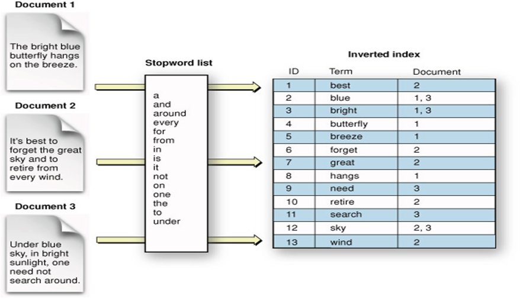

### Analysis && Inverted-index

When a document request for indexing is received by elasticsearch, which in turn is handled by lucene, it converts the document in a stream of tokens. After tokens are generated, the same gets filtered by the configured filter. This entire process is called the analysis process, and is applied on every document that gets indexed.

Below is an example of the analysis process. Consider an html tag with embedded sentence as the document as the input. When the same passes through a set of filters and tokenizers, it gets converted into a set of tokens, which finally gets indexed.

Post the analysis process, when the data is converted into tokens, these tokens are stored into an internal structure called inverted index. This structure maps each unique term in an index to a document. This data structure allows for faster data search and text analytics. All the attributes like term count, term position and other such attributes are associated with the term. Below is a sample visualization of how an inverted index may look like.

The original input gets stored in a system field names "_source".
