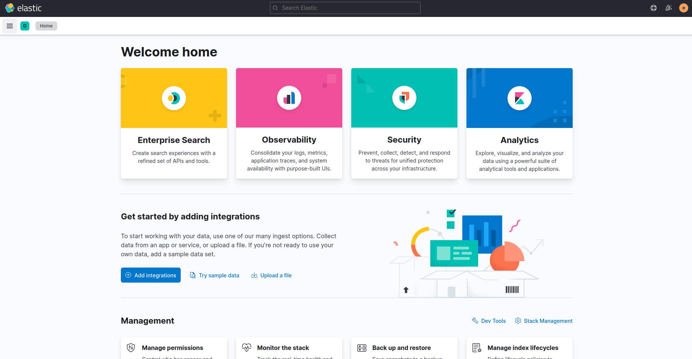
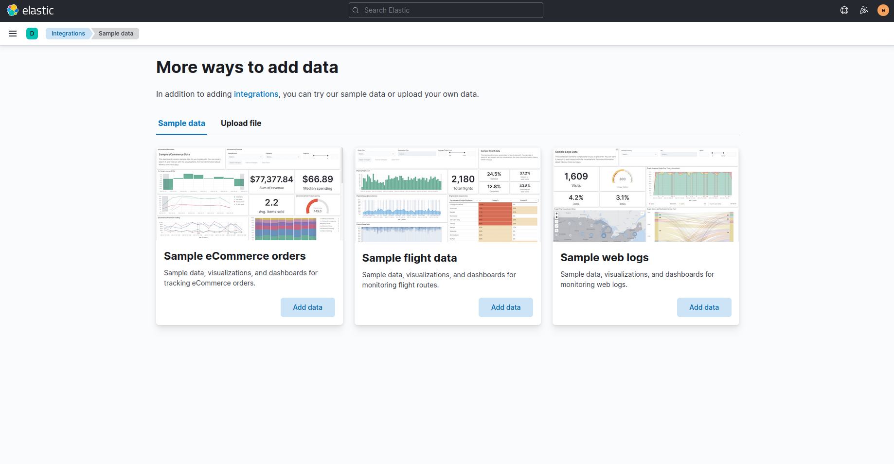
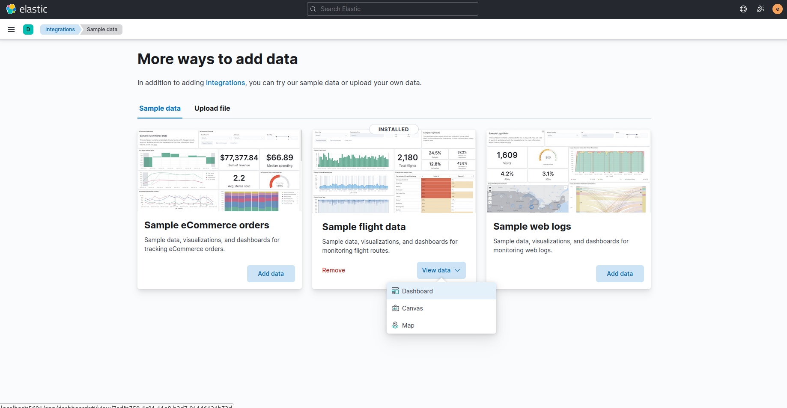
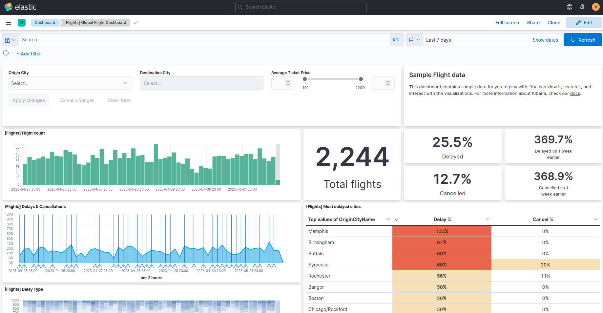
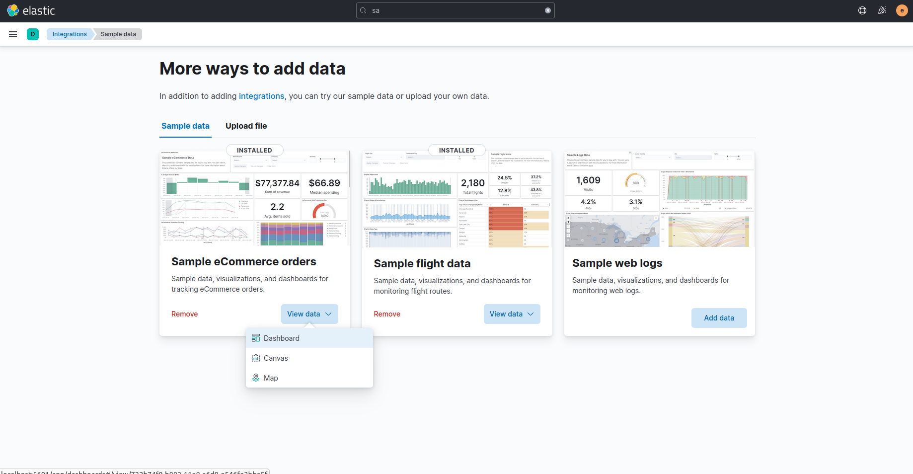
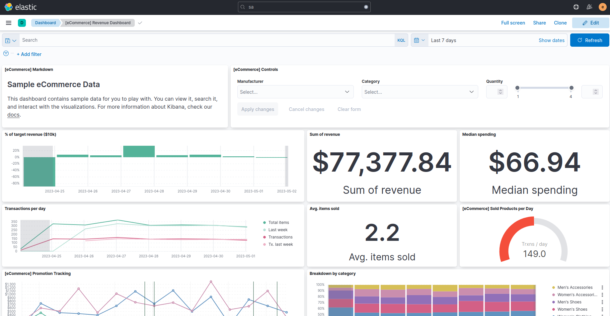
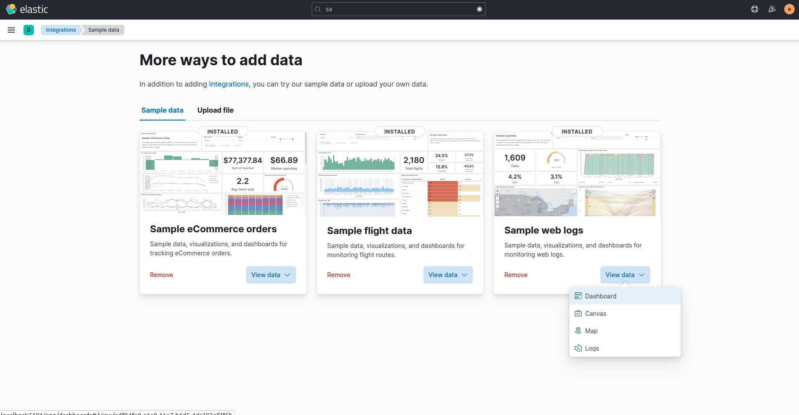
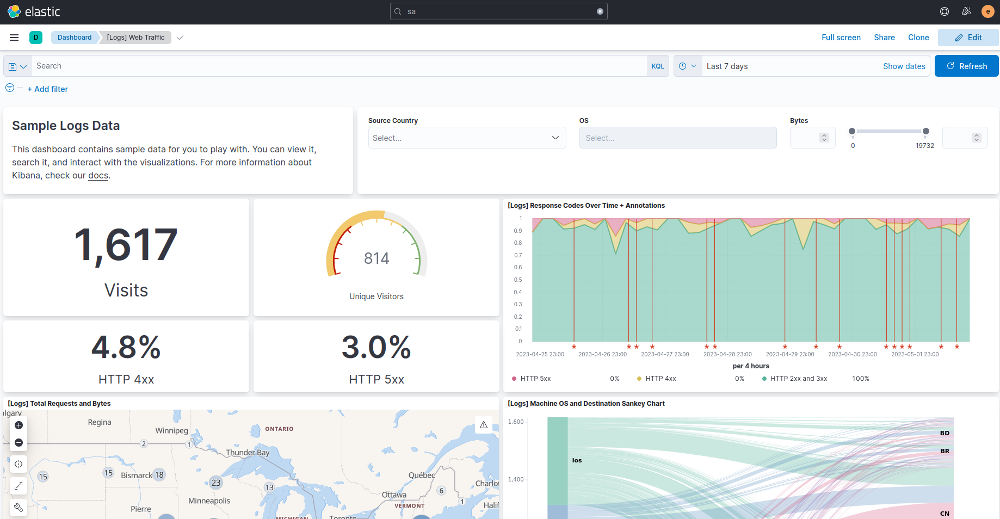

## Add sample data

### Sample flight data

#### Add sample flight data

1. On the home page, click `Try sample data`.

2. On the `Sample flight data` card, click `Add data`.

3. Once the data is added, click `View data > Dashboard`.

We’re taken to the `Global Flight` dashboard, a collection of charts, graphs, maps, and other visualizations of the the data in the `kibana_sample_data_flights` index.

#### Remove sample flight data

1. On the home page, click `Try sample data`.

2. On the `Sample flight data` card, click `Remove`.

### Sample eCommerce orders

#### Add sample eCommerce orders data

1. On the home page, click `Try sample data`.

2. On the `Sample eCommerce orders` card, click `Add data`.

3. Once the data is added, click `View data > Dashboard`.

We’re taken to the `eCommerce Revenue` Dashboard, a collection of charts, graphs, maps, and other visualizations of the the data in the `kibana_sample_data_ecommerce` index.

#### Remove sample eCommerce orders data

1. On the home page, click `Try sample data`.

2. On the `Sample eCommerce orders` card, click `Remove`.

### Sample web logs

#### Add sample web logs data

1. On the home page, click `Try sample data`.

2. On the `Sample web logs` card, click `Add data`.

3. Once the data is added, click `View data > Dashboard`.

We’re taken to the `Logs Web Traffic` Dashboard, a collection of charts, graphs, maps, and other visualizations of the the data in the `kibana_sample_data_logs` index.

#### Remove sample web logs data

1. On the home page, click `Try sample data`.

2. On the `Sample web logs` card, click `Remove`.

