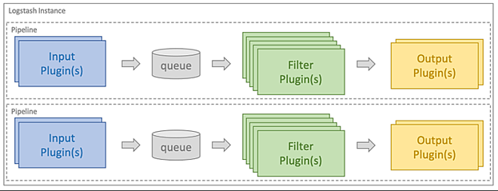

#### Logstash

Logstash is a plugin-based data collection and processing engine that makes it easy to collect, process and forward data to different systems, but the important part is that it helps in normalizing different schemas, which means data is gathered from different systems and made available in a single format. Processing is organized into one or more pipelines. In each pipeline, one or more input plugins receive or collect data and then is placed on an internal queue, later it is processed by any available filter plugins and then pushed to the output plugin, in our case this is Elasticsearch.

