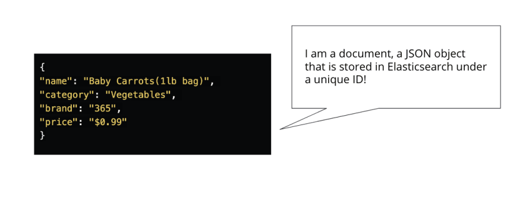
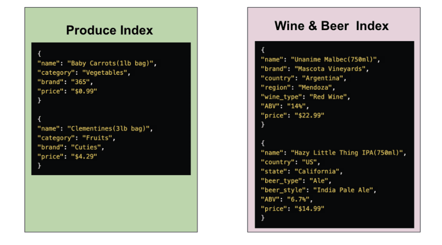

### CRUD operatrions

#### Background info

In Elasticsearch, data is stored as documents. A document is a JSON object that stores whatever data you want to store in Elasticsearch. Each document has a unique ID.



In a JSON object, you have a list of fields or key value pairs. For example, it has the name of the product, category it belongs in, its brand and price.

Documents that are logically related to each other are grouped into an index.



#### Create an index

Syntax:
```markdown
PUT Name-of-the-Index
```
1. Define index
```markdown
PUT favorite_candy
```
Result: 
```markdown
{
  "acknowledged" : true,
  "shards_acknowledged" : true,
  "index" : "favorite_candy"
}
```
#### Index a document

We use the word index as both a noun and a verb. When index is used as a verb, it means that we are storing documents in Elasticsearch.

When indexing a document, either POST or PUT can be used.

##### POST

You use POST when you want Elasticsearch to autogenerate an id for your document.

Syntax:
```markdown
POST Name-of-the-Index/_doc
{
  "field": "value"
}
```
We start the request with a POST HTTP verb, then we specify the name of the index, then the document endpoint(_doc), followed by a JSON object with whatever data you want to store in Elasticsearch.

2. index document
```markdown
POST favorite_candy/_doc
{
  "first_name": "Lisa",
  "candy": "Sour Skittles"
}
```
Result:
```markdown
{
  "_index" : "favorite_candy",
  "_type" : "_doc",
  "_id" : "AwwMdIcBSPjXCaUBeAxK",
  "_version" : 1,
  "result" : "created",
  "_shards" : {
    "total" : 2,
    "successful" : 1,
    "failed" : 0
  },
  "_seq_no" : 0,
  "_primary_term" : 1
}
```
##### PUT

You use the verb PUT when you want to assign a specific id to your document. An instance where you may want to use PUT is when you are indexing data with a natural identifier(i.e. purchase order number, patient id, & etc).

Syntax:
```markdown
PUT Name-of-the-Index/_doc/id-you-want-to-assign-to-this-document
{
  "field": "value"
}
```
3. index document
```markdown
PUT favorite_candy/_doc/1
{
  "first_name": "John",
  "candy": "Starburst"
}
```
Result: 
```markdown
{
  "_index" : "favorite_candy",
  "_type" : "_doc",
  "_id" : "1",
  "_version" : 1,
  "result" : "created",
  "_shards" : {
    "total" : 2,
    "successful" : 1,
    "failed" : 0
  },
  "_seq_no" : 1,
  "_primary_term" : 1
}
```
#### Read a document

Now that we have indexed a document, let's send a request to examine the content of the document that has been indexed.

We use the following syntax to read a document.

Syntax:
```markdown
GET Name-of-the-Index/_doc/id-of-the-document-you-want-to-retrieve
```
4. Get documebnt with id 1
```markdown
GET favorite_candy/_doc/1

{
  "_index" : "favorite_candy",
  "_type" : "_doc",
  "_id" : "1",
  "_version" : 1,
  "_seq_no" : 1,
  "_primary_term" : 1,
  "found" : true,
  "_source" : {
    "first_name" : "John",
    "candy" : "Starburst"
  }
}
```
5. Index another document with an ID that already exists. 
```markdown
PUT favorite_candy/_doc/1
{
  "first_name": "Sally",
  "candy": "Snickers"
}
```
Result: 
```markdown
{
  "_index" : "favorite_candy",
  "_type" : "_doc",
  "_id" : "1",
  "_version" : 2,
  "result" : "updated",
  "_shards" : {
    "total" : 2,
    "successful" : 1,
    "failed" : 0
  },
  "_seq_no" : 2,
  "_primary_term" : 1
}
```
Notice that we are getting a **200-OK** response instead of **201-Created** response this time. It tells you that a document with an id of 1 has been updated.

Note that **version** number has now been changed to 2. 

**_version** number signifies the number of times the document has been created, updated, or deleted. Since document 1 has been originally created then accidentally updated	, the version number is now 2.

##### _create Endpoint

**_create** endpoint prevents you from overwriting an existing document. When this endpoint is in use, the request to index a document with an existing ID is denied. Elasticsearch will throw an error and reject the request.

The following syntax is used when _create endpoint is used.

Syntax:
```markdown
PUT Name-of-the-Index/_create/id-you-want-to-assign-to-this-document
{
  "field": "value"
}
```
6. index document with existing id and _create endpoint.
```markdown
PUT favorite_candy/_create/1
{
  "first_name": "Sally",
  "candy": "Snickers"
}
```
Result:
```markdown
{
  "error" : {
    "root_cause" : [
      {
        "type" : "version_conflict_engine_exception",
        "reason" : "[1]: version conflict, document already exists (current version [2])",
        "index_uuid" : "x8WgK9whSneIgDCOgqrRhA",
        "shard" : "0",
        "index" : "favorite_candy"
      }
    ],
    "type" : "version_conflict_engine_exception",
    "reason" : "[1]: version conflict, document already exists (current version [2])",
    "index_uuid" : "x8WgK9whSneIgDCOgqrRhA",
    "shard" : "0",
    "index" : "favorite_candy"
  },
  "status" : 409
}
```
#### Update a document

There will be times when you will want to update an existing document. 

You will use the following syntax to update a field of a document.

Syntax:
```markdown
POST Name-of-the-Index/_update/id-of-the-document-you-want-to-update
{
  "doc": {
    "field1": "value",
    "field2": "value",
  }
}  
```
In the JSON object, make sure to add "doc". This tells Elasticsearch that only the fields specified in the nested curly brackets are meant to be updated.

7. update documet
```markdown
POST favorite_candy/_update/1
{
  "doc": {
    "candy": "M&M's"
  }
}
```
Result:
```markdown
{
  "_index" : "favorite_candy",
  "_type" : "_doc",
  "_id" : "1",
  "_version" : 4,
  "result" : "updated",
  "_shards" : {
    "total" : 2,
    "successful" : 1,
    "failed" : 0
  },
  "_seq_no" : 4,
  "_primary_term" : 1
}
```
This **POST** request directs Elasticsearch to update(**_update**) a document with an id of **1** in the **favorite_candy** index. By including **"doc"** in the JSON object, it also clarifies that only the field and value specified in nested curly brackets should be updated. The rest of the information in the original document should be kept in tact.

#### Delete a document

The following syntax is used to delete a document.

Syntax:
```markdown
DELETE Name-of-the-Index/_doc/id-of-the-document-you-want-to-delete
```
8. Delete document with id 1
```markdown
DELETE favorite_candy/_doc/1
```
Result:
```markdown
{
  "_index" : "favorite_candy",
  "_type" : "_doc",
  "_id" : "1",
  "_version" : 5,
  "result" : "deleted",
  "_shards" : {
    "total" : 2,
    "successful" : 1,
    "failed" : 0
  },
  "_seq_no" : 5,
  "_primary_term" : 1
}
```
You will see a **200-OK** response that states that document(**_doc**) with an id of **1** has been **deleted**. The version number is now **5**.

9. Get document that not exist
```markdown
GET favorite_candy/_doc/1
```
Result:
```markdown
{
  "_index" : "favorite_candy",
  "_type" : "_doc",
  "_id" : "1",
  "found" : false
}
```
If you send a GET request for document 1 again, you will get a 404 error message because document 1 no longer exists!
