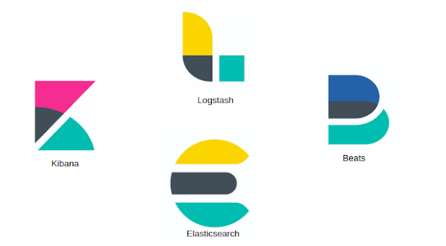
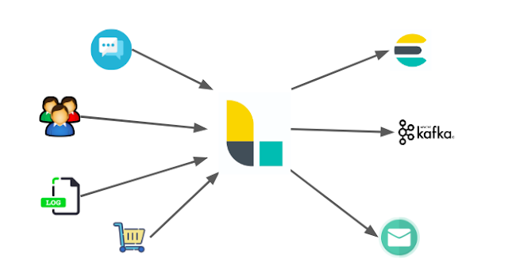
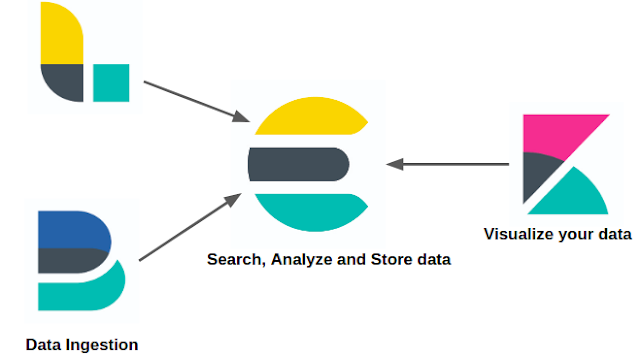
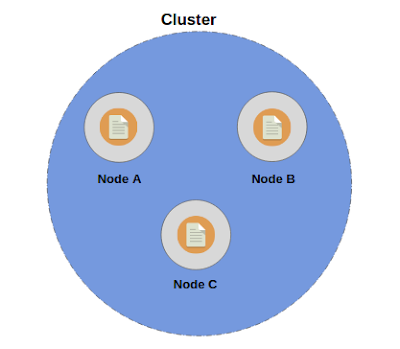
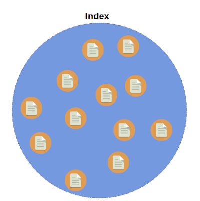
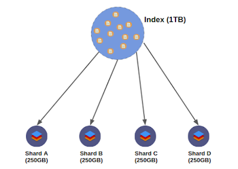
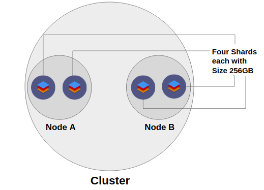
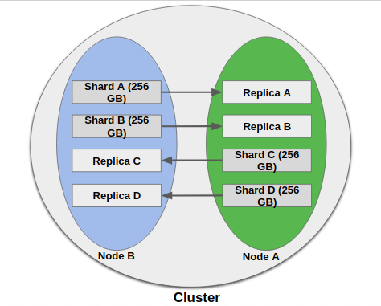

# Introduction to Elasticsearch and the ELK Stack

From [Introduction to Elasticsearch and the ELK Stack, Part 1](https://dzone.com/articles/introduction-to-elasticsearch-and-the-elk-stack) and [Introduction to Elasticsearch and the ELK Stack, Part 2](https://dzone.com/articles/introduction-to-elasticsearch-and-the-elk-stack-pa)

### Elastic Stack



#### Kibana

Kibana is basically an analytics and visualization platform, which lets you easily visualize data from Elasticsearch and analyze it to make sense of it. You can assume Kibana as an Elasticsearch dashboard where you can create visualizations such as pie charts, line charts, and many others.


#### Logstash

Logstash is a data processing pipeline. The data that Logstash receives will be handled as events, which can be anything of your choice. They could be log file entries, e-commerce orders, customers, chat messages, etc. These events are then processed by Logstash and shipped off to one or more destinations. A couple of examples could be Elasticsearch, a Kafka queue, an e-mail message, or to an HTTP endpoint.



A Logstash pipeline consists of three stages: an input stage, a filter stage, and an output stage. Each stage can make use of a plugin to do its task.


- Input Stage: The input stage is how Logstash receives the data. An input plugin could be: a file so that Logstash reads events from a file; an HTTP endpoint; a relational database; a Kafka queue Logstash can listen to; etc.

- Filter Stage: The filter stage is all about how Logstash processes the events received from the input stage plugins. Here we can parse CSV, XML, or JSON. We can also perform data enrichment, such as looking up an IP address and resolving its geographical location or looking up data in a relational database.

- Output Stage: An output plugin is where we send the processed events to. Formally, those places are called stashes. These places can be a database, a file, an Elasticsearch instance, a Kafka queue, and so on.

```markdown
#A sample Logstash pipeline configuration:

input {  
      file {  
           path => "/path/to/your/logfile.log"  
      }  
 }  
 filter {  
      if [request] in ["/robots.txt"] {  
           drop {}  
      }  
 }  
 output {  
      file {  
           path => "%{type}_%{+yyyy_MM_dd}.log"  
      }  
 }  
```

#### Beats

Beats is basically a collection of data shippers. Data shippers are basically lightweight agents with a particular purpose. You can install one or more data shippers on your server(s) as per the requirements. They then send data to Elasticsearch or Logstash. There is n number of data shippers and each data shipper is called a beat. Each beat or data shipper collects different kinds of data and hence serves different purposes.



For example, there is a beat named Filebeat, which is used for collecting log files and sending the log entries off to either Logstash or Elasticsearch. Filebeat ships with modules for common log files, such as nginx, the Apache web server, or MySQL. This is very useful for collecting log files such as access logs or error logs.

### The Architecture of Elasticsearch

#### Nodes and Clusters

A **node** is a server that stores data. A **cluster** is simply a collection of  nodes i.e, servers. Each node or server contains a part of the cluster's data, the data we add to the cluster. Simply put, the collection of nodes contains the entire data set for the cluster.



#### Indices and Documents

Each data item that you may want to store over Elasticsearch nodes is called as a document. A document is the smallest unit which can be indexed. As a matter of fact, documents are simply JSON objects and are analogous to rows in a relational database, like MySQL. 



Now, each document can have some properties just like columns in a relational database. The question is, where are these documents stored? As you already know, our data is stored across the nodes within the cluster, and the documents are organized within indices. Hence, an index is simply a collection of logically related documents and analogous to a table in a relational database. Each and every document is uniquely identified by an ID, which is either assigned by Elasticsearch automatically or by the developer when adding those documents to the index. Hence, each and every document can be uniquely identified by its index and its ID.

#### Sharding



Elasticsearch is superbly scalable, with all the credit for this going to its distributed architecture. It is made possible by sharding. In cases like this, where the size of an index exceeds the hardware limits of a single node, sharding comes to the rescue. Sharding solves this problem by dividing the indices into smaller pieces and these pieces are called shards. 



#### Replication

Even in today's world, hardware failure or some kind of similar failure is inevitable. So, our system must be prepared to face this by having some means of fault tolerance. That's where replication comes to the rescue. Elasticsearch natively supports replication, meaning that shards are copied. These copied shards are referred to as replica shards or just replicas. The "original" shards that have been copied are called as primary shards. As a matter of fact, the primary shard and its replicas are referred to as a replication group. 



There are two major benefits we get from replication:

- Fault Tolerance and High Availability
- Enhanced Performance

#### How a Search Query Is Executed (Quick Overview):

Simply put, when a client sends a search query cluster, it hits a node. This node, which has received the request from the client, is called a coordinating Node, which means that now this node is responsible for sending out the query to other nodes, assembling the results, and responding to the client.

Now, as the coordinating node itself contains the shard upon which the search query is to be performed, it first performs the search query first on itself, then sends out the query to every other shard or replica in the index.
