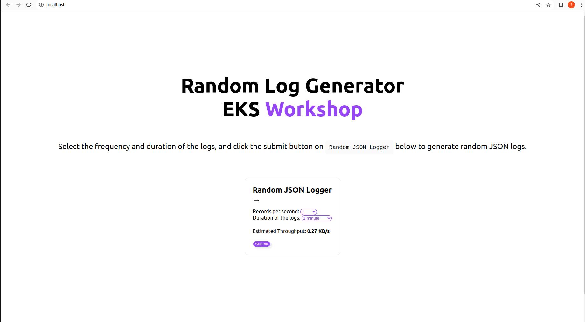
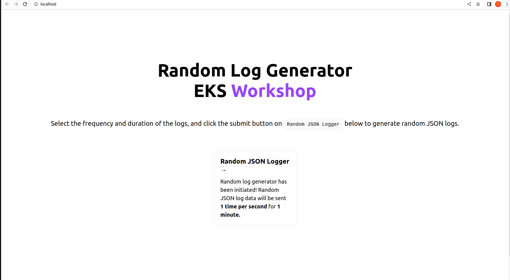

## Data Visulization with Kibana

> See [Data Visulization with Kibana](https://catalog.workshops.aws/eks-logging/en-US/opensearch/3-kibana)  


### Create dataset

- ***Run log generator***

```
docker run -p 80:80 -d madebybk/nextjs-random-json-logger:latest
```
- ***Go to [localhost](http://localhost:80) in browser.***



- ***Then set value for `Records per second` and `Duration of the logs` field then submit.***



- ***Will generate random logs messages:***

```json
{"level":"info","error_code":"err_5","request_method":"GET","message":"This is a sample log message no. 56","request_uri":"/api/logger","timestamp":"2023-05-10T16:34:53.187Z[UTC]","status":"OK","server_protocol":"HTTP/1.1"}
{"level":"info","error_code":"err_5","request_method":"GET","message":"This is a sample log message no. 57","request_uri":"/api/logger","timestamp":"2023-05-10T16:34:54.187Z[UTC]","status":"OK","server_protocol":"HTTP/1.1"}
{"level":"info","error_code":"err_4","request_method":"GET","message":"This is a sample log message no. 58","request_uri":"/api/logger","timestamp":"2023-05-10T16:34:55.188Z[UTC]","status":"WARN","server_protocol":"HTTP/1.1"}
{"level":"info","error_code":"err_2","request_method":"GET","message":"This is a sample log message no. 59","request_uri":"/api/logger","timestamp":"2023-05-10T16:34:56.187Z[UTC]","status":"WARN","server_protocol":"HTTP/1.1"}
{"level":"info","error_code":"err_1","request_method":"GET","message":"This is a sample log message no. 60","request_uri":"/api/logger","timestamp":"2023-05-10T16:34:57.187Z[UTC]","status":"OK","server_protocol":"HTTP/1.1"}
```

---

### Index log data

- ***Go to `Home > Upload a file`***


- ***In `Upload file` tab click `Select or drag and drop a file` select log file.***


- ***Click `Import` buttom.***


- ***Enter name for index and click `Import`***


- ***Now click on `View index in Discover` to view imported logs***


- ***In `Discover` You can monitor the logs generated by the log simulator***


---

#### Visualize

1. ***The result of the sample log `status (OK, WARN, FAIL)` will be analyzed.***

**Pie**


**Donut**


**Area**


2. ***The result of the sample log `error_code` will be analyzed.***

**Area**


