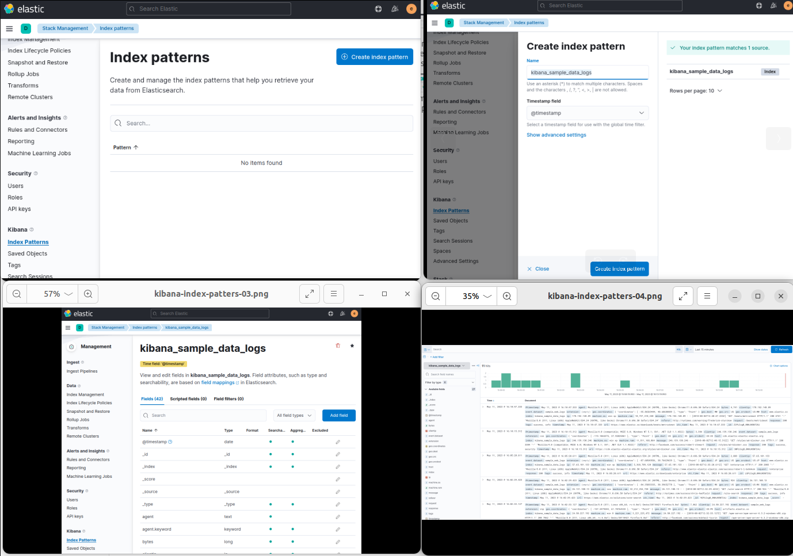
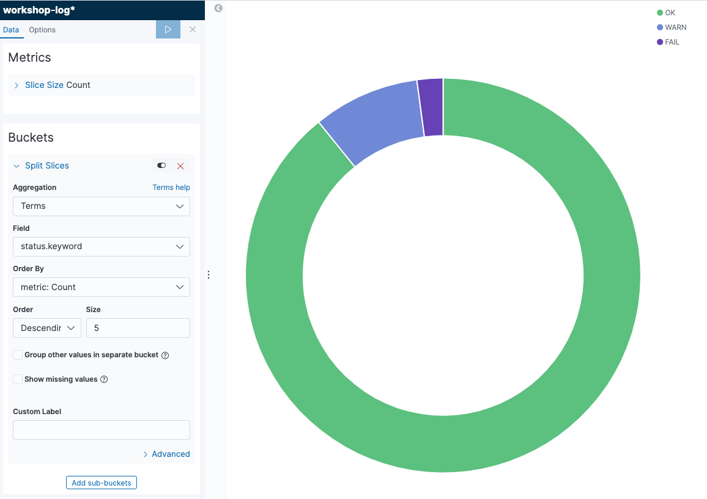
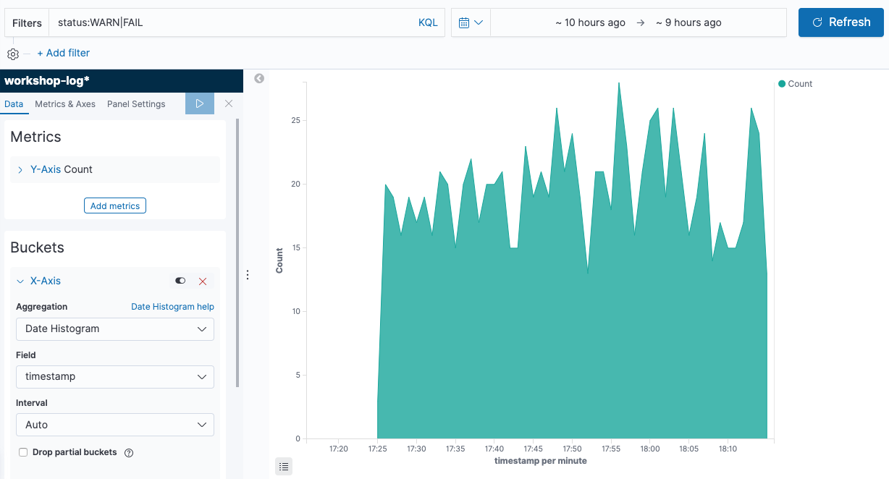
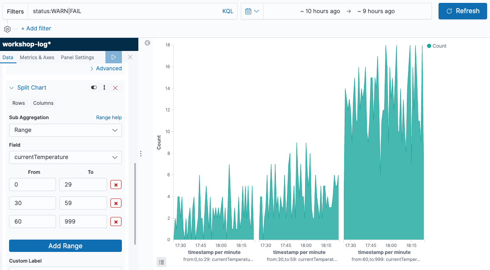
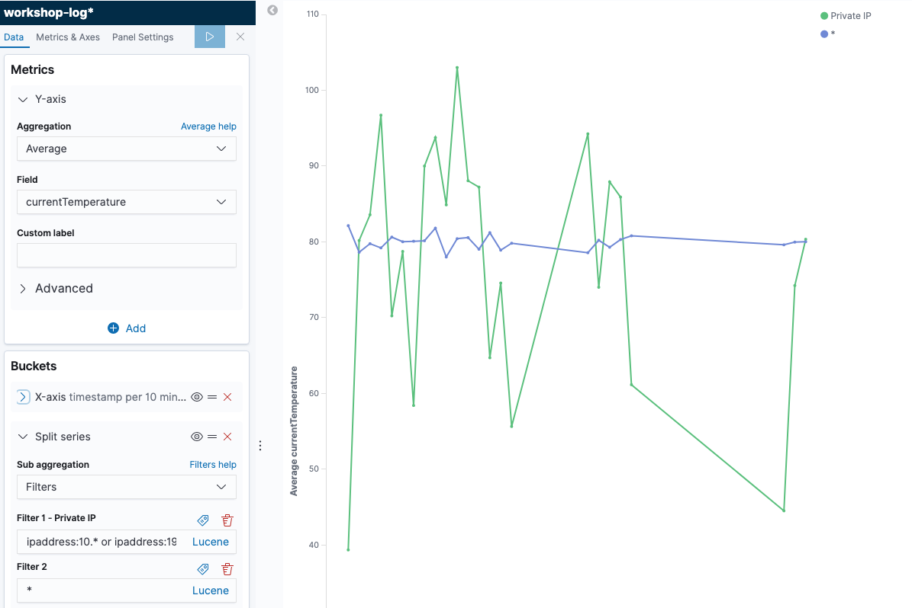
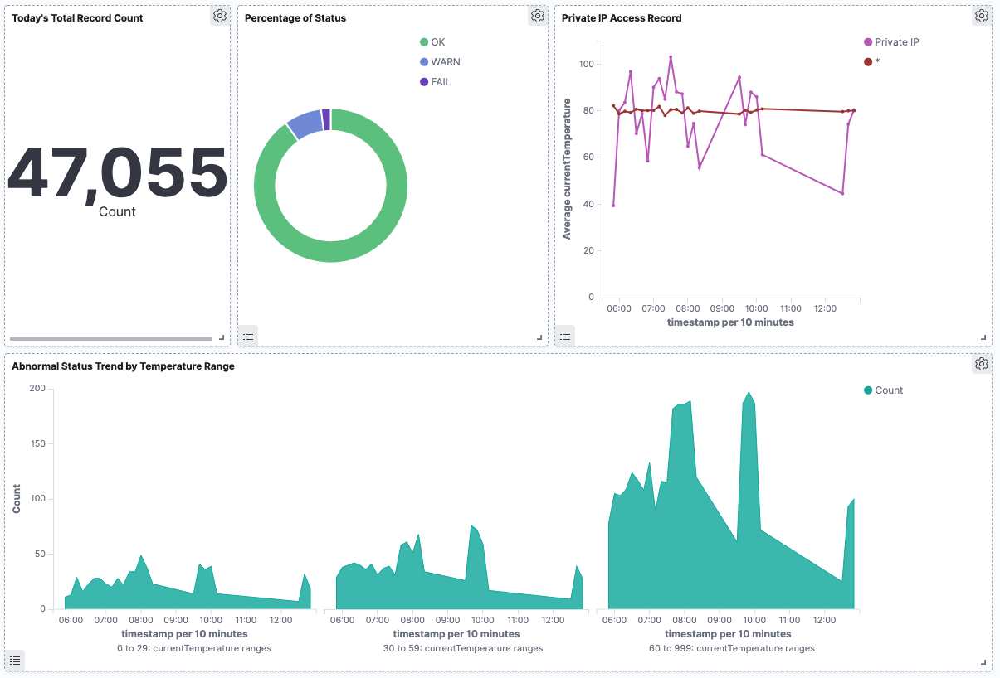

### Creating an Index pattern

> See [Kibana Doc: Create an index pattern](https://www.elastic.co/guide/en/kibana/7.17/index-patterns.html)  

> Kibana requires an index pattern to access the Elasticsearch data that you want to explore. An index pattern selects the data to use and allows you to define properties of the fields.  

See [Create an index pattern](https://github.com/rasoulifarhad/elastic-stack/blob/main/kibana/kibana-index-patterns.md)

#### Verifying Data using Discover

1. Click kibana_discover icon in the menu on the left of the screen to open the Discover page.
2. Choose [workshop-log-*] from the pull-down menu in the Index pattern on the left of the screen, a bar chart is displayed. Make sure that the Document is lined up in below. In addition, click the calendar button in the top right of the screen to specify the time to search, and click [Today] in “Commonly used”. It displays all of the logs for the day. You can change the display and search scope by changing the values here.
3. At the content of Document, you can see that the fields such as sensorId, currentTemperature, Ipaddress. starus, and timestamp, same as the template to specified in Lab1 are also displayed here. Meanwhile, some fields are not specified, such as _id, _type, _index, and _score. These are the metadata that Elasticsearch adds automatically. discover_document
4. Enter status:WARN in the search field at the top left of the screen, and click [Update] button in the right. This input works as a filter criterion so that only Document displayed on the screen is in the WARN status, and the WARN is highlighted. Also, Document for FAIL or WARN is displayed by entering status:FAIL|WARN.
5. Try to do [Update] by entering currentTemperature>100. You can filter records only with a temperature of 100 degrees or higher. Also, you can combine multiple conditions. By filtering such as currentTemperature>100 and status:WARN, you can search records only with a temperature of 100 degrees or higher and WARN. You can also search by combining OR conditions such as (currentTemperature > 120 and status:WARN) or sensorId: 10. Then, you can filter records only with the IP address starting with 1 by using ipaddress:1*. Please try various search criteria.
6. Click [status] in the Field list on the left in this state. For each WARN, OK, and FAIL including this Field, the ratio of each item in the search result will be displayed. Note, however, that this value is an approximate value, not a whole quantity.

#### Creating Graphs with Visualize

we will create a pie chart to visualize a ratio of OK, WARN and FAIL status of all records.

1. Click kibana_visualize icon in the menu on the left of the screen to open the Visualize page. Next, click [+ Create a visualization] button to go to the graph creation screen. Select [Pie] from the pop-up menu. Then, move to the data source selection screen, and open the graph creation screen by choosing [workshop-log-*].
2. In the menu on the left of the screen, confirm “Metrics”. You can see “Count” displayed in [Slice size ] here. This indicates that the aggregation target of the graph is the number of records. You can change the aggregation target by clicking [Slice size] to display the details menu. There is no need to do anything because the number of records is as it is.
3. Move onto “Buckets”. There are two menus here. Choose [Split Series]. This adds an axis to aggregate values on a single chart. Note that if you choose [Split Chart], you will create the same numbers of the graphs as the number of categories of metrics you selected. The graph that has as much as categories of metrics you have chosen will be created.
4. Let’s look at the steps to add the status to the axis to aggregate value here. Choose [Terms] in “Aggregation”. We typically use this Terms to add an axis for the category type field such as status. Then, add [status.keyword] in “Field”.
5. Once you could set this up, click [▷] button on the left menu to reflect the changes. The following graph will be displayed. When you hover your cursor over the graph, the ratio of each item will be displayed. The chart can be adjusted in details from [Options] tab at the top of the left menu.
6. At last, give the graph a name and save it. Click [Save] button in the top left of the screen, give a name “Percentage of Status” for “Title”, and click [Confirm Save]. After completed saving, click the [Visualize] link in the top left of the screen, and go back to the top page of Visualize menu. Now, you can see that the graph you have created is displayed in the list.

#### Chronological change of FAIL/WARN numbers by temperature

Now, let’s create a chronological graph. By dividing data into multiple groups by sensor temperature, let’s visualize the number of abnormal records.

1. Click kibana_visualize icon in the menu on the left of the screen to open the Visualize page. Next, click [+] button on the top right of the screen to go to the graph creation screen. From the pop-up menu, choose [Area]. Then, move to the data source selection screen to open the graph creation screen by choosing [workshop-log-*].

2. Enter status:WARN|FAIL in “Filters” at the top left of the screen. Next, click to the left of the field to specify the time range to the right, click [Relative] tab, and then choose [1] [Hours ago]. This allows you to change the time zone displayed on the screen. Then, Click [Update] on the right of the screen to reflect the changes. Now you can perform the aggregation that is filtered to records with abnormal status.

3. Choose [X-Axis] in “Bucket”, and then choose [Date Histogram] from “Aggregation”. This adds information of date and time to the X axis, that is, the horizontal axis. By clicking [▷] button on the left menu, changes you made are applied, and the following graph will be displayed.

4. Click [Add sub-buckets] button at the bottom of the left menu to set additional axes. Next, choose [Split Chart], and display a separate graph for each temperature range. Then, choose [Range] from “Sub Aggregation”. Let’s divide the temperature range of IoT sensors into three things such as low, high, and ultra-high temperature here. Choose [currentTemperature] from “Field”, click [Add Range] button once, and enter “0” - “29”, “30” - “59”, “60” - “999” in “From”, “To”. Then, click [Columns] directly below the “Split Chart”. This allows you to choose whether the split graph is displayed vertically or horizontally. [Rows] displays the graph vertically, and [Columns] displays the graph horizontally. In this case, it is better to choose the graph horizontally, so that we can compare how many abnormal records are in each temperature range. When you have completed here, click [▷] button on the left menu again to apply the changes, and the following graph will be displayed.

5. Save the graph you have created by giving it a name. Click [Save] button in the top left of the screen, give it a name “Abnormal Status Trend by Temperature Range” in “Title”, and click [Confirm Save].

#### Creating Additional Charts

In a similar manner, create a few graphs to check regularly on the dashboard. First, divide the IP range into Private IP band and others so that you can check the date and time variation of average values for the temperature obtained from each sensor:

1. Click kibana_visualize icon on the left menu of the screen to open the Visualize page. Next, click [+] button on the top right of the screen to go to the graph creation screen. From the pop-up menu, click [Line]. Then, move onto the data source selection screen to open the graph creation screen by choosing [workshop-log-*].
2. Click [Y-Axis] in “Metrics” to open the details, and choose [Average] from “Aggregation”. Then, choose [currentTemperature] in the “Field” below.
3. Choose “X-Axis” from “Buckets”, and then choose [Date Histogram] from “Aggregation”. This adds the information of date and time to the X axis.
4. Click [Add sub-buckets] button at the bottom of the left menu to set additional axes. Then choose [Split Series], and choose [Filters] from “Sub Aggregation”. The private IP range here uses the commonly used 10.0.0.0-10.255.255.255 and 192.168.0.0-192.168.255.255, enter ipaddress:10.* or ipaddress:192.168.* in ““Flter 1”, then click the button like a tag in the top right of the entry field. “Filter 1 label” is displayed, so enter “Private IP”. In a similar manner, click [Add Filter] to add * in “Flter 2”. By clicking [▷] button on the left menu, the changes will be reflected as follows.

5. Click [Save] in the top left of the screen, give a name “Private IP Access Trend” in “Title”, and click [Confirm Save]. You can now view the total number of records.

At last, create a chart that counts the number of simple records.

1. Click kibana_visualize icon on the left menu of the screen to open the Visualize page. Next, click [+] button on the top right of the screen to go to the graph creation screen. From the pop-up menu choose [Metric]. After moving onto the data source selection screen, the graph creation screen will open by choosing [workshop-log].
2. Click the calendar button in the field that specifies the time range in the top right of the screen, and choose [Today] from “Commonly Used”. Then, click [Save] in the top left of the screen, give it a name “Today’s Total Record Count” in “Title”, and click [Confirm Save]. You can now view the total number of records.

#### Creating a dashboards with Dashboards

In this section, view the graphs created in the previous section into a single dashboard.

1. Click kibana_dashboards icon on the left menu of the screen to open the Dashboards page, and click [+ Create new dashboard] button in the center of the screen.
2. After moving onto the edit screen, click [Add] from the top left menu of the screen, and add the graph. The four graphs you have created so far are displayed in the list. Click them in order, and add them all to your dashboard. After completing, click  button in the top right to go back to the previous screen.
3. After that, you can choose, move, and resize the graph as you like. For example, you can display a dashboard in the following form.

4. After completing to edit the dashboard, click [Save] button in the top left corner of the screen to save it with the title “IoT Sensor Metrics Dashboard”. You can now view your dashboard at any time.

