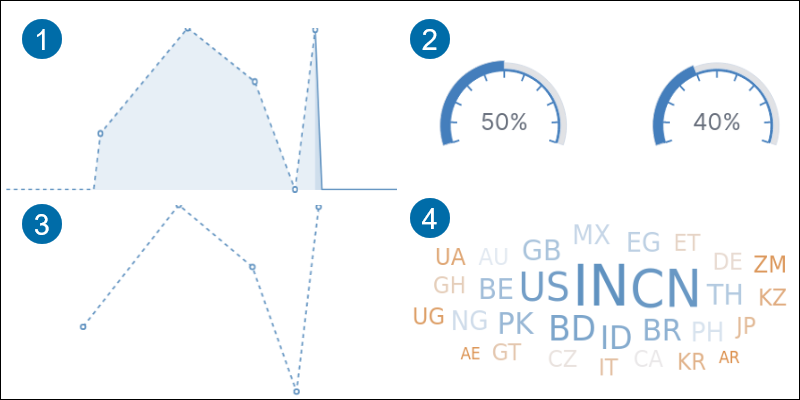
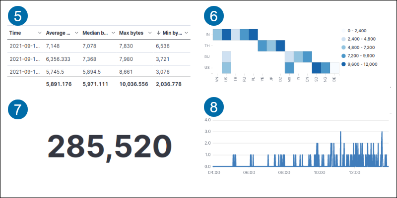
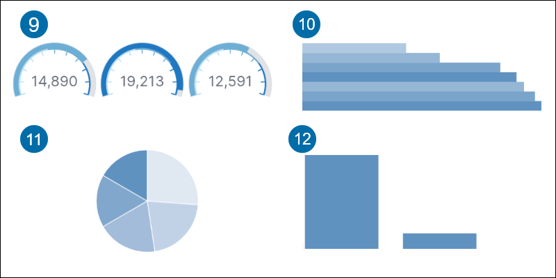

### Kibana Aggregations

The Kibana aggregation tool provides various visualizations:

**1.** Area highlights data between an axis and a line.

**2.** Goal tracks the metric progress to a specified goal.

**3.** Line displays data as a series of points.

**4.** Tag cloud shows word frequency.

**5.** Data table shows data in rows and columns.

**6.** Heat map displays data in a cell-matrix with shaded regions.

**7.** Metric shows a calculation result as a single number.

**8.** Timelion graphs time series data.

**9.** Gauge shows a metric status.

**10.** Horizontal bar displays data in horizontal bars on an axis.

**11.** Pie compares data in portions compared to a whole.

**12.** Vertical bar shows data in a vertical bar on an axis.

