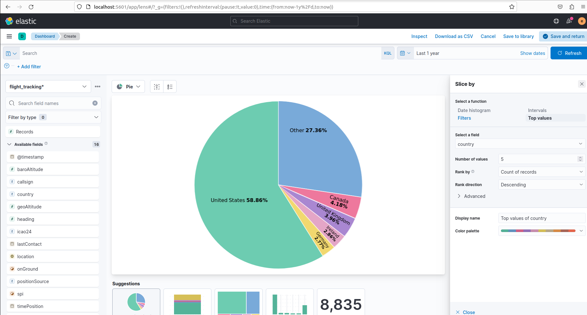
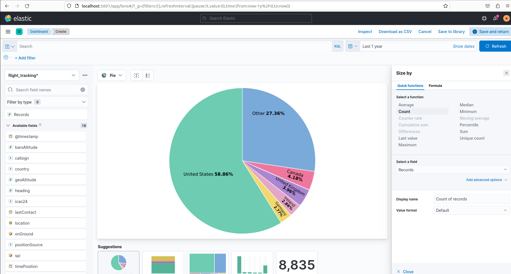
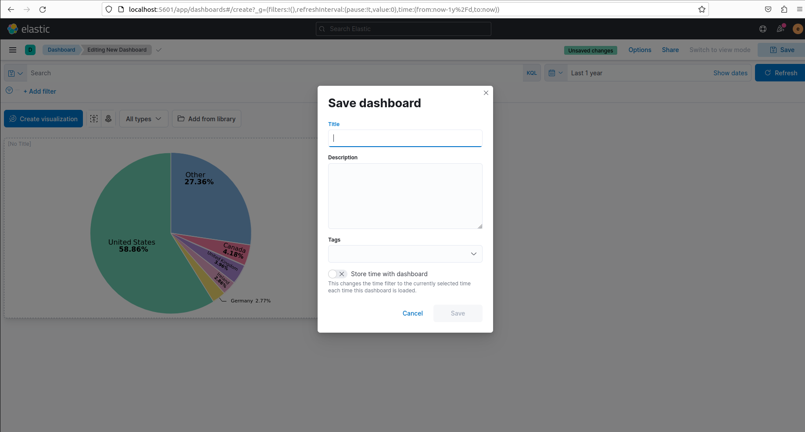

### Kibana Visualizations with Lens- Pie chart

 

#### Steps

 

 

 

 

 

 

 

 

 

 

 

 

 

 

 

 

#### Some good blog for visualizations in kibana

- [Search and Data Visualizations Part 6 – Create Visualizations and Dashboards](https://blogs.oracle.com/peoplesoft/post/search-and-visualizations-6-kibana-objects)
- [Complete Kibana Tutorial to Visualize and Query Data](https://phoenixnap.com/kb/kibana-tutorial)
- [Kibana Lens Tutorial: Easily Create Stunning Visualizations](https://coralogix.com/blog/kibana-lens-tutorial-easily-create-stunning-visualizations/)
- [LAB 2: VISUALIZATION AND ANALYTICS IN KIBANA](https://intro.aesworkshops.com/02-kibana.html)
- [Data Visulization with Kibana](https://catalog.workshops.aws/eks-logging/en-US/opensearch/3-kibana)

