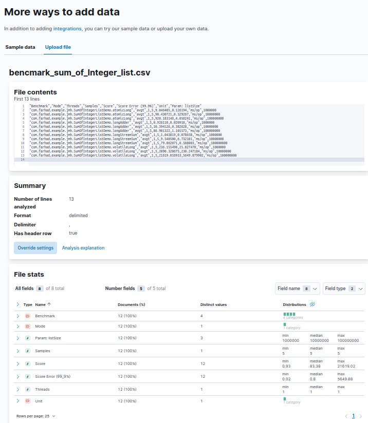
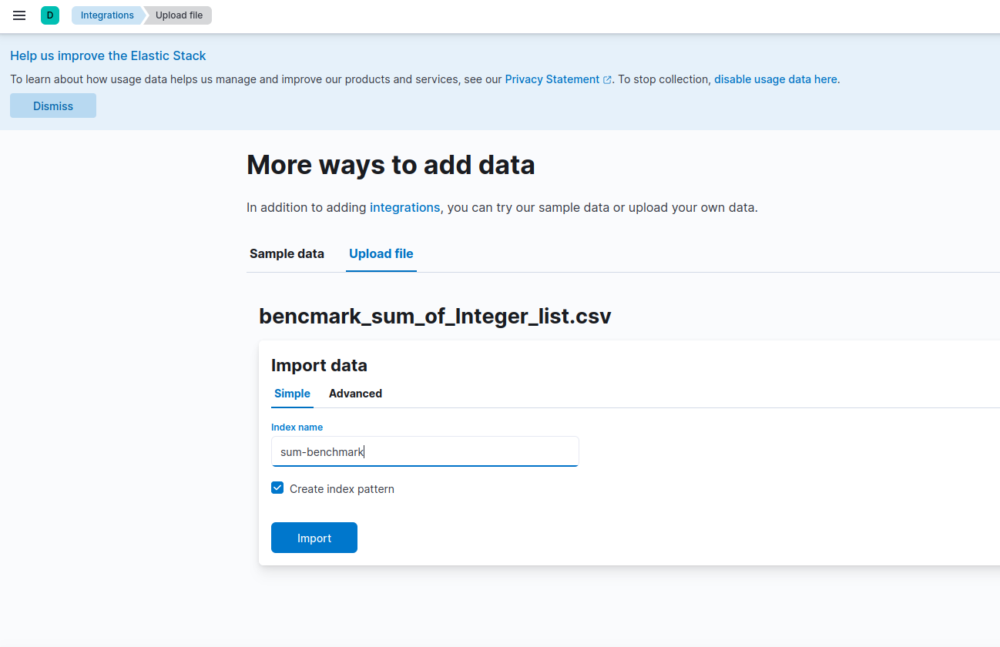
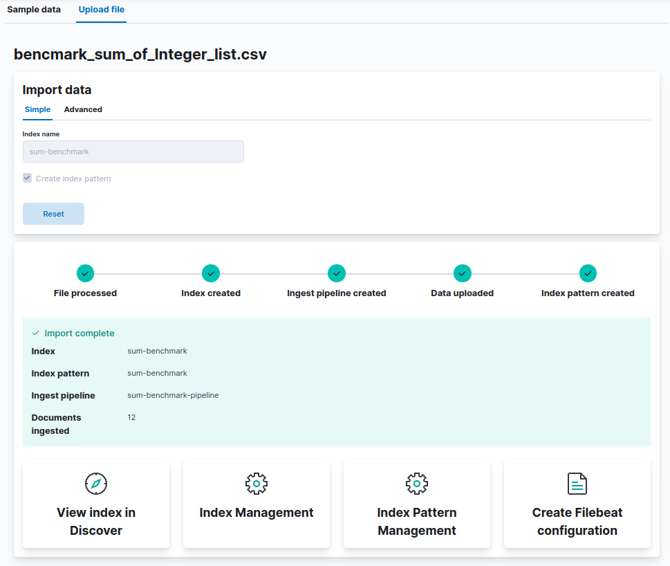
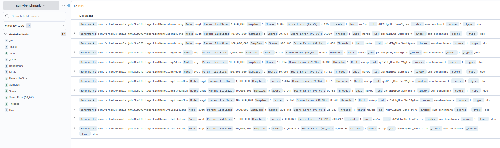
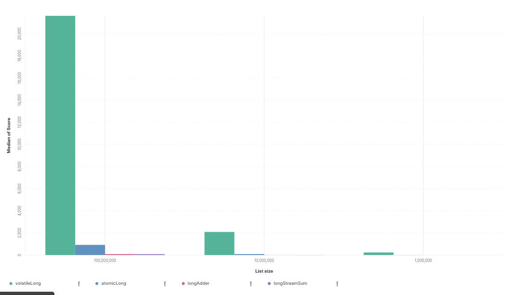

## Visualize Benchmark 


### Sum Random Numbers in list

- Generate List with Random int

```java
        private List<Integer> testIntList;
        
        @Setup(Level.Trial)
        public void setup() {
            testIntList = new Random()
                                .ints()
                                .limit(listSize)
                                .boxed()
                                .collect(Collectors.toList());
        }
````

- Running benchmark with three deferent list size

```java
        @Param({"1000000", "10000000", "100000000"})
        public int listSize;
```

- Benchmark calculation of sum ,where sum variable be AtomicLong, LongAdder, VolatileLong, longStreamSum.

```java
   
    public static class VolatileLong {
        private volatile long value = 0L;
        public long getValue() {
            return value ;
        }
        public synchronized void add(long amount) {
            this.value += amount;
        }
    }

    @Benchmark
    public void atomicLong(Blackhole blackhole, IntegerListSupplier state) {
        AtomicLong sum = new AtomicLong(0);
        state.get().parallelStream().forEach(sum::addAndGet);
        blackhole.consume(sum.get());
    }

    @Benchmark
    public void longAdder(Blackhole blackhole, IntegerListSupplier state) {
        LongAdder sum = new LongAdder();
        state.get().parallelStream().forEach(sum::add);
        blackhole.consume(sum.sum());
    }

    @Benchmark
    public void volatileLong(Blackhole blackhole, IntegerListSupplier state) {
        VolatileLong sum = new VolatileLong();
        state.get().parallelStream().forEach(sum::add);
        blackhole.consume(sum.getValue());
    }

    @Benchmark
    public void longStreamSum(Blackhole blackhole, IntegerListSupplier state) {
        long sum = state.get().parallelStream().mapToLong(v -> v).sum();
        blackhole.consume(sum);
    }
```
- Full benchmark class

```java

@BenchmarkMode(Mode.AverageTime)
@OutputTimeUnit(TimeUnit.MILLISECONDS)
@Fork(value = 1, warmups = 1)
@Warmup(iterations = 1)
public class SumOfIntegerListDemo {
    
    @State(Scope.Benchmark)
    public static class IntegerListSupplier {

        @Param({"1000000", "10000000", "100000000"})
        public int listSize;

        private List<Integer> testIntList;
        
        @Setup(Level.Trial)
        public void setup() {
            testIntList = new Random()
                                .ints()
                                .limit(listSize)
                                .boxed()
                                .collect(Collectors.toList());
        }

        public List<Integer> get() {
            return testIntList;
        }
    }

    public static class VolatileLong {
        private volatile long value = 0L;
        public long getValue() {
            return value ;
        }
        public synchronized void add(long amount) {
            this.value += amount;
        }
    }

    @Benchmark
    public void atomicLong(Blackhole blackhole, IntegerListSupplier state) {
        AtomicLong sum = new AtomicLong(0);
        state.get().parallelStream().forEach(sum::addAndGet);
        blackhole.consume(sum.get());
    }

    @Benchmark
    public void longAdder(Blackhole blackhole, IntegerListSupplier state) {
        LongAdder sum = new LongAdder();
        state.get().parallelStream().forEach(sum::add);
        blackhole.consume(sum.sum());
    }

    @Benchmark
    public void volatileLong(Blackhole blackhole, IntegerListSupplier state) {
        VolatileLong sum = new VolatileLong();
        state.get().parallelStream().forEach(sum::add);
        blackhole.consume(sum.getValue());
    }

    @Benchmark
    public void longStreamSum(Blackhole blackhole, IntegerListSupplier state) {
        long sum = state.get().parallelStream().mapToLong(v -> v).sum();
        blackhole.consume(sum);
    }

    public static void main(String[] args) throws RunnerException {
        Options options = new OptionsBuilder()
                                        .include(SumOfIntegerListDemo.class.getSimpleName())
                                        .result(String.format("target/%s_results_%s.csv", SumOfIntegerListDemo.class.getSimpleName(), LocalDateTime.now()))
                                        .resultFormat(ResultFormatType.CSV)
                                        .build();
        new Runner(options).run();
    }
}
```

##### Benchmark data

```csv
"Benchmark","Mode","Threads","Samples","Score","Score Error (99.9%)","Unit","Param: listSize"
"atomicLong","avgt",1,5,9.046405,0.126194,"ms/op",1000000
"atomicLong","avgt",1,5,90.430721,0.329267,"ms/op",10000000
"atomicLong","avgt",1,5,920.183146,4.056241,"ms/op",100000000
"longAdder","avgt",1,5,0.926110,0.020910,"ms/op",1000000
"longAdder","avgt",1,5,10.394126,0.382628,"ms/op",10000000
"longAdder","avgt",1,5,86.901322,1.101573,"ms/op",100000000
"longStreamSum","avgt",1,5,1.043819,0.078658,"ms/op",1000000
"longStreamSum","avgt",1,5,9.540500,6.732101,"ms/op",10000000
"longStreamSum","avgt",1,5,79.862071,0.508003,"ms/op",100000000
"volatileLong","avgt",1,5,236.155498,25.827478,"ms/op",1000000
"volatileLong","avgt",1,5,2090.320675,230.247184,"ms/op",10000000
"volatileLong","avgt",1,5,21619.016933,5649.879902,"ms/op",100000000
```

#### Import with kibana `Upload a file` 

- Go to ***Home > Upload a file > select file*** then clock `Import` button.



- name the index in  `Index name` text box  field and click `Import` button.



- Now click in `View index in discover` to check imported data. 



- imported data in ***Discover*** 



#### Visualize


