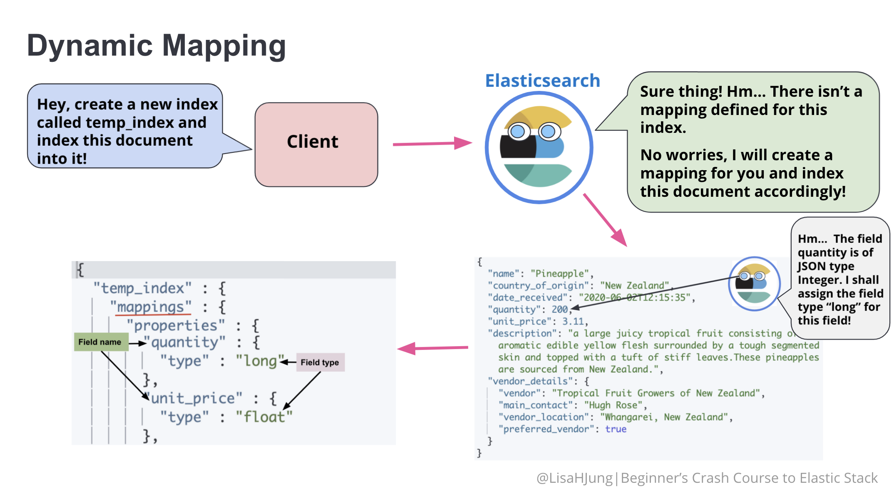
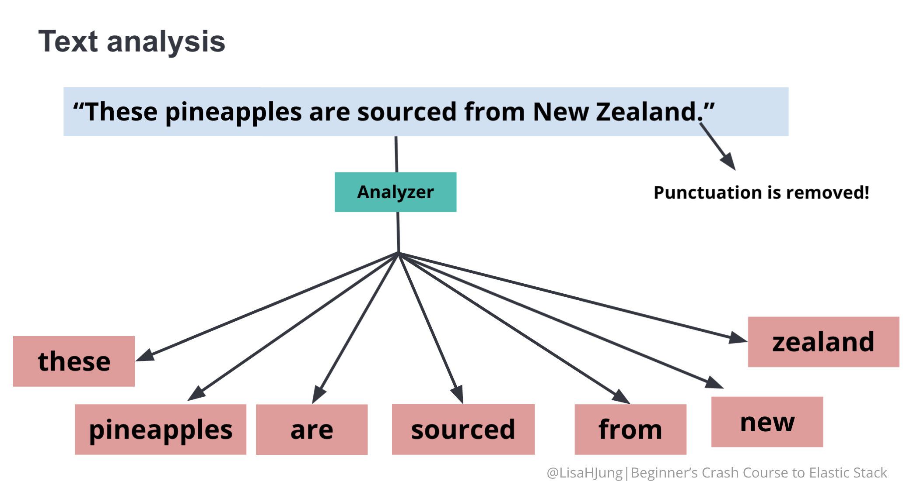
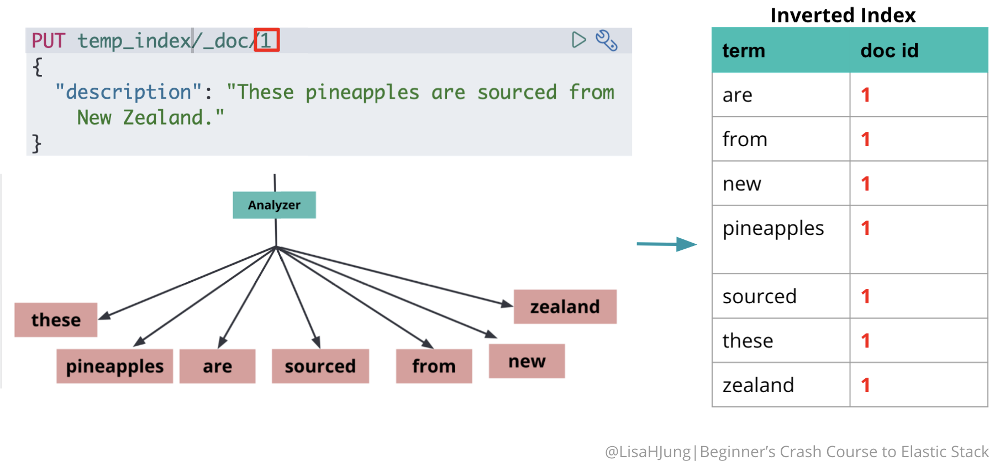
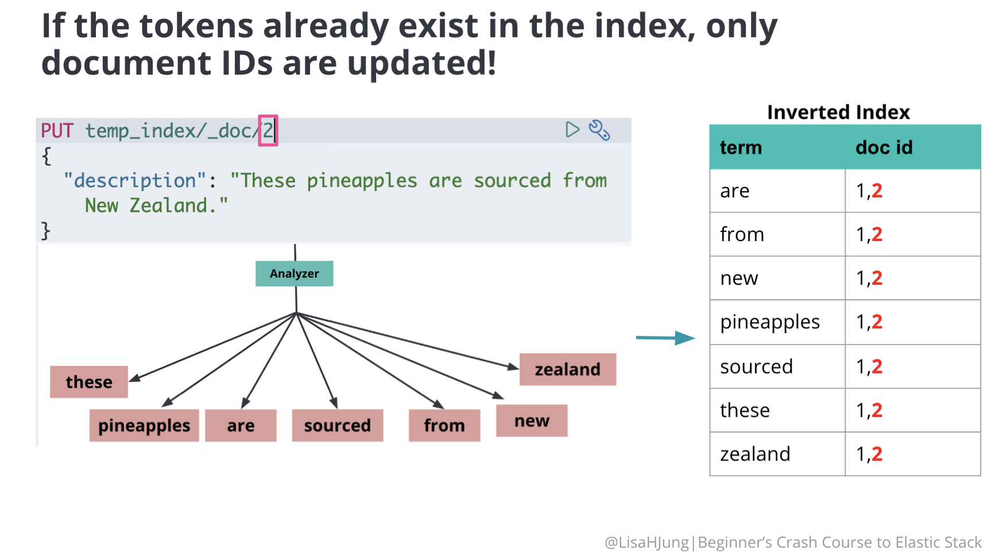
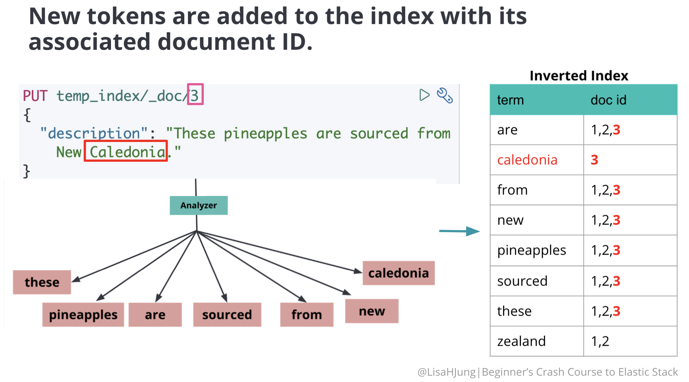
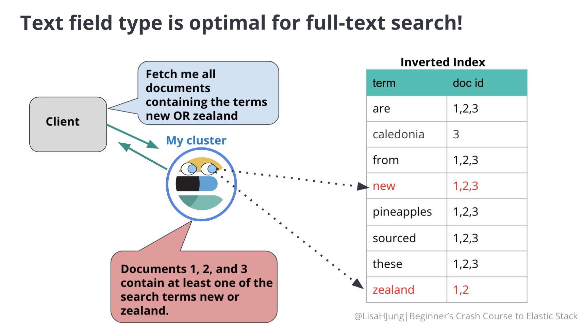
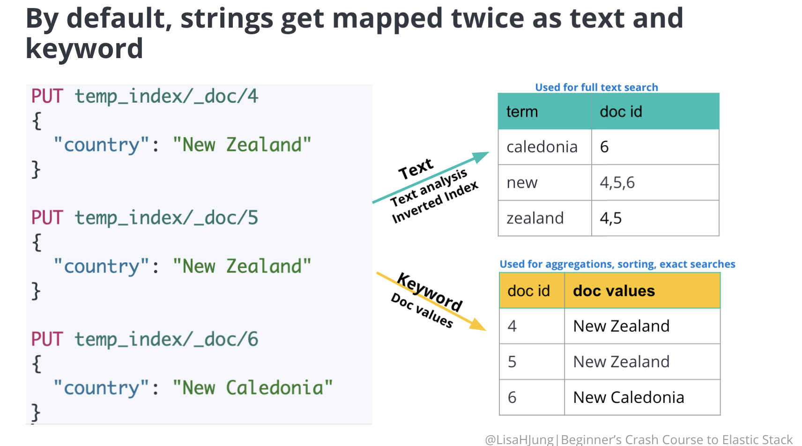
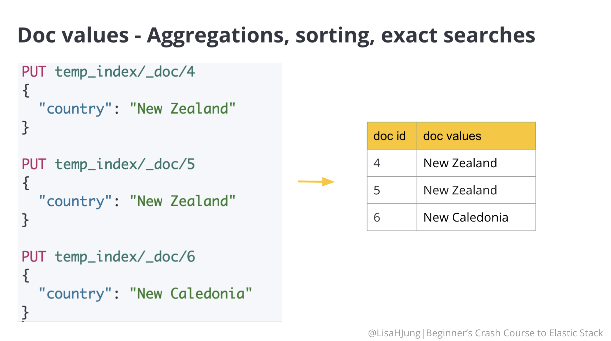
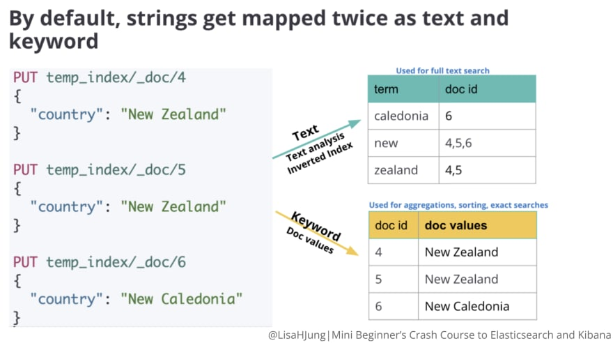

### Mapping

Mapping is the process of defining how a document and its fields are indexed and stored. It defines the type and format of the fields in the documents. As a result, mapping can significantly affect how Elasticsearch searches and stores data.

#### Dynamic Mapping

When a user does not define mapping in advance, Elasticsearch creates or updates the mapping as needed by default. This is known as **dynamic mapping**.

With dynamic mapping, Elasticsearch looks at each field and tries to infer the data type from the field content. Then, it assigns a type to each field and creates a list of field names and types known as mapping.

Depending on the assigned field type, each field is indexed and primed for different types of requests(full text search, aggregations, sorting). This is why mapping plays an important role in how Elasticsearch stores and searches for data.

#### View the Mapping

Syntax:

GET Enter_name_of_the_index_here/_mapping

Example:

GET temp_index/_mapping

#### Indexing Strings

There are two kinds of string field types:

- Text
- Keyword

By default, every string gets mapped twice as a text field and as a keyword multi-field. Each field type is primed for different types of requests.

**Text field** type is designed for full-text searches.

**Keyword** field type is designed for exact searches, aggregations, and sorting.

You can customize your mapping by assigning the field type as either text or keyword or both!

#### Text Field Type

##### Text Analysis

Ever notice that when you search in Elasticsearch, it is not case sensitive or punctuation does not seem to matter? This is because text analysis occurs when your fields are indexed.

By default, strings are analyzed when it is indexed. The string is broken up into individual words also known as tokens. The analyzer further lowercases each token and removes punctuations.

##### Inverted Index

Once the string is analyzed, the individual tokens are stored in a sorted list known as the **inverted index**. Each unique token is stored in the **inverted index** with its associated ID.

The same process occurs every time you index a new document.

##### Keyword Field Type

**Keyword** field type is used for aggregations, sorting, and exact searches. These actions look up the document ID to find the values it has in its fields.

**Keyword** field is suited to perform these actions because it uses a data structure called **doc values** to store data.

For each document, the document id along with the field value(original string) are added to the table. This data structure(**doc values**) is designed for actions that require looking up the document ID to find the values it has in its fields.

When Elasticsearch dynamically creates a mapping for you, it does not know what you want to use a string for so it maps all strings to both field types.

In cases where you do not need both field types, the default setting is wasteful. Since both field types require creating either an inverted index or doc values, creating both field types for unnecessary fields will slow down indexing and take up more disk space.

This is why we define our own mapping as it helps us store and search data more efficiently.

##### Text field types

'

By default, every field that contains string data type gets mapped twice as a **text** field and as a **keyword** multi-field.

Each field type is primed for different types of requests.

**Text** field type is used for full text search.

**keyword** field type is used for aggregations, sorting, and exact searches.

In scenarios where you do not need both field types, the default setting is wasteful. It will slow down indexing and use up more disk space.

When deciding on a string field type, make sure you know for what purpose this field will be serving so you can choose the correct field type.

