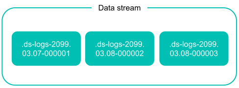

### Data streams

[from](https://www.elastic.co/guide/en/elasticsearch/reference/7.17/data-streams.html#data-streams)

#### Recap

##### Backing indices



##### Read requests


##### Write index


#### Steps for setup

**1.** Create an index lifecycle policyedit

```json

PUT _ilm/policy/my-lifecycle-policy
{
  "policy": {
    "phases": {
      "hot": {
        "actions": {
          "rollover": {
            "max_primary_shard_size": "50gb"
          }
        }
      },
      "warm": {
        "min_age": "30d",
        "actions": {
          "shrink": {
            "number_of_shards": 1
          },
          "forcemerge": {
            "max_num_segments": 1
          }
        }
      },
      "cold": {
        "min_age": "60d",
        "actions": {
          "searchable_snapshot": {
            "snapshot_repository": "found-snapshots"
          }
        }
      },
      "frozen": {
        "min_age": "90d",
        "actions": {
          "searchable_snapshot": {
            "snapshot_repository": "found-snapshots"
          }
        }
      },
      "delete": {
        "min_age": "735d",
        "actions": {
          "delete": {}
        }
      }
    }
  }
}

```

**2.** Create component templates

```json

# Creates a component template for mappings
PUT _component_template/my-mappings
{
  "template": {
    "mappings": {
      "properties": {
        "@timestamp": {
          "type": "date",
          "format": "date_optional_time||epoch_millis"
        },
        "message": {
          "type": "wildcard"
        }
      }
    }
  },
  "_meta": {
    "description": "Mappings for @timestamp and message fields",
    "my-custom-meta-field": "More arbitrary metadata"
  }
}

```

**And**

```json

# Creates a component template for index settings
PUT _component_template/my-settings
{
  "template": {
    "settings": {
      "index.lifecycle.name": "my-lifecycle-policy"
    }
  },
  "_meta": {
    "description": "Settings for ILM",
    "my-custom-meta-field": "More arbitrary metadata"
  }
}

```

**3.** Create an index template

```json

PUT _index_template/my-index-template
{
  "index_patterns": ["my-data-stream*"],
  "data_stream": { },
  "composed_of": [ "my-mappings", "my-settings" ],
  "priority": 500,
  "_meta": {
    "description": "Template for my time series data",
    "my-custom-meta-field": "More arbitrary metadata"
  }
}

```

**4.** Create the data stream

To automatically create your data stream, submit an indexing request that targets the stream’s name. This name must match one of your index template’s index patterns.


```json

PUT my-data-stream/_bulk
{ "create":{ } }
{ "@timestamp": "2099-05-06T16:21:15.000Z", "message": "192.0.2.42 - - [06/May/2099:16:21:15 +0000] \"GET /images/bg.jpg HTTP/1.0\" 200 24736" }
{ "create":{ } }
{ "@timestamp": "2099-05-06T16:25:42.000Z", "message": "192.0.2.255 - - [06/May/2099:16:25:42 +0000] \"GET /favicon.ico HTTP/1.0\" 200 3638" }

```

You can also manually create the stream using the create data stream API. The stream’s name must still match one of your template’s index patterns.

```json

PUT _data_stream/my-data-stream

```


<!--
#### Add documents to a data stream

```json

POST /my-data-stream/_doc/
{
  "@timestamp": "2099-03-08T11:06:07.000Z",
  "user": {
    "id": "8a4f500d"
  },
  "message": "Login successful"
}
```

```json
PUT /my-data-stream/_bulk?refresh
{"create":{ }}
{ "@timestamp": "2099-03-08T11:04:05.000Z", "user": { "id": "vlb44hny" }, "message": "Login attempt failed" }
{"create":{ }}
{ "@timestamp": "2099-03-08T11:06:07.000Z", "user": { "id": "8a4f500d" }, "message": "Login successful" }
{"create":{ }}
{ "@timestamp": "2099-03-09T11:07:08.000Z", "user": { "id": "l7gk7f82" }, "message": "Logout successful" }
```

#### Update documents in a data stream by query

```json
POST /my-data-stream/_update_by_query
{
  "query": {
    "match": {
      "user.id": "l7gk7f82"
    }
  },
  "script": {
    "source": "ctx._source.user.id = params.new_id",
    "params": {
      "new_id": "XgdX0NoX"
    }
  }
}
```

#### Delete documents in a data stream by query

```json
POST /my-data-stream/_delete_by_query
{
  "query": {
    "match": {
      "user.id": "vlb44hny"
    }
  }
}

```

#### Update or delete documents in a backing index

You’ll need:

- The [document ID](https://www.elastic.co/guide/en/elasticsearch/reference/7.17/mapping-id-field.html)
- The name of the backing index containing the document
- If updating the document, its [sequence number and primary term](https://www.elastic.co/guide/en/elasticsearch/reference/7.17/optimistic-concurrency-control.html)

To get this information, use a [search request](https://www.elastic.co/guide/en/elasticsearch/reference/7.17/use-a-data-stream.html#search-a-data-stream):

```json
GET /my-data-stream/_search
{
  "seq_no_primary_term": true,
  "query": {
    "match": {
      "user.id": "yWIumJd7"
    }
  }
```

Response:

```json
{
  "took": 20,
  "timed_out": false,
  "_shards": {
    "total": 3,
    "successful": 3,
    "skipped": 0,
    "failed": 0
  },
  "hits": {
    "total": {
      "value": 1,
      "relation": "eq"
    },
    "max_score": 0.2876821,
    "hits": [
      {
        "_index": ".ds-my-data-stream-2099.03.08-000003",      
        "_type": "_doc",
        "_id": "bfspvnIBr7VVZlfp2lqX",              
        "_seq_no": 0,                               
        "_primary_term": 1,                         
        "_score": 0.2876821,
        "_source": {
          "@timestamp": "2099-03-08T11:06:07.000Z",
          "user": {
            "id": "yWIumJd7"
          },
          "message": "Login successful"
        }
      }
    ]
  }
}
```

To update the document, use an [index API](https://www.elastic.co/guide/en/elasticsearch/reference/7.17/docs-index_.html) request with valid if_seq_no and if_primary_term arguments:

```json

PUT /.ds-my-data-stream-2099-03-08-000003/_doc/bfspvnIBr7VVZlfp2lqX?if_seq_no=0&if_primary_term=1
{
  "@timestamp": "2099-03-08T11:06:07.000Z",
  "user": {
    "id": "8a4f500d"
  },
  "message": "Login successful"
}
```

To delete the document, use the [delete API](https://www.elastic.co/guide/en/elasticsearch/reference/7.17/docs-delete.html):

```json

DELETE /.ds-my-data-stream-2099.03.08-000003/_doc/bfspvnIBr7VVZlfp2lqX

```

To delete or update multiple documents with a single request, use the [bulk API](https://www.elastic.co/guide/en/elasticsearch/reference/7.17/docs-bulk.html)'s delete, index, and update actions. For index actions, include valid [if_seq_no and if_primary_term](https://www.elastic.co/guide/en/elasticsearch/reference/7.17/docs-bulk.html#bulk-optimistic-concurrency-control) arguments.

```json
PUT /_bulk?refresh
{ "index": { "_index": ".ds-my-data-stream-2099.03.08-000003", "_id": "bfspvnIBr7VVZlfp2lqX", "if_seq_no": 0, "if_primary_term": 1 } }
{ "@timestamp": "2099-03-08T11:06:07.000Z", "user": { "id": "8a4f500d" }, "message": "Login successful" }
```

#### Manually roll over a data stream

```json
POST /my-data-stream/_rollover/
```

#### Get statistics for a data stream

```json
GET /_data_stream/my-data-stream/_stats?human=true
```

#### Generation

Each data stream tracks its generation: a six-digit, zero-padded integer that acts as a cumulative count of the stream’s rollovers, starting at 000001.

```
.ds-<data-stream>-<yyyy.MM.dd>-<generation>

```

#### Append-only

Data streams are designed for use cases where existing data is rarely, if ever, updated. You cannot send update or deletion requests for existing documents directly to a data stream. Instead, use the [update by query](https://www.elastic.co/guide/en/elasticsearch/reference/7.17/use-a-data-stream.html#update-docs-in-a-data-stream-by-query) and [delete by query](https://www.elastic.co/guide/en/elasticsearch/reference/7.17/use-a-data-stream.html#delete-docs-in-a-data-stream-by-query) APIs.

If needed, you can [update or delete documents](https://www.elastic.co/guide/en/elasticsearch/reference/7.17/use-a-data-stream.html#update-delete-docs-in-a-backing-index) by submitting requests directly to the document’s backing index.

#### Convert an index alias to a data stream

To convert an index alias with a write index to a data stream with the same name, use the [migrate to data stream API](https://www.elastic.co/guide/en/elasticsearch/reference/7.17/indices-migrate-to-data-stream.html). During conversion, the alias’s indices become hidden backing indices for the stream. The alias’s write index becomes the stream’s write index. The stream still requires a matching index template with data stream enabled.

POST _data_stream/_migrate/my-time-series-data

-->


