### Search

[see](https://dev.to/lisahjung/beginner-s-guide-to-understanding-the-relevance-of-your-search-with-elasticsearch-and-kibana-29n6)

Elasticsearch is a search engine that allows us to store, search, and analyze data. It stores data as documents. Documents that share similar traits are grouped into an index. 

When you search for something, Elasticsearch retrieves relevant documents. Then, it presents these documents as search results. 

**What are true positives?**

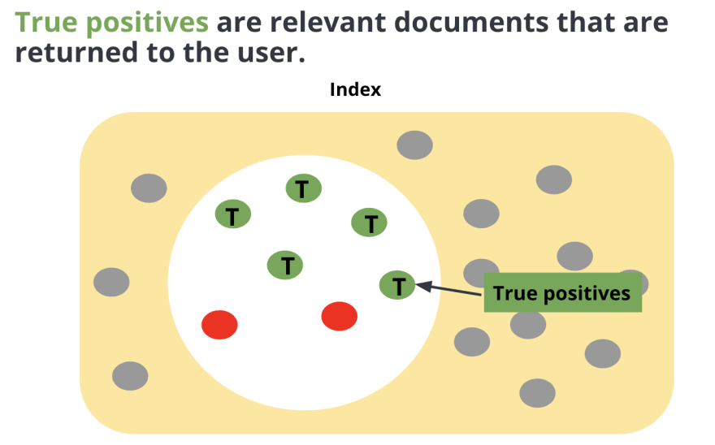

When you send a search query to Elasticsearch, it retrieves documents that it considers relevant to the query. 

These are the dots inside the white circle. These are the documents that Elasticsearch sends back as a response.

Some of the these retrieved documents are what you expect to see in your response. These are known as true positives. 

**What are false positives?**

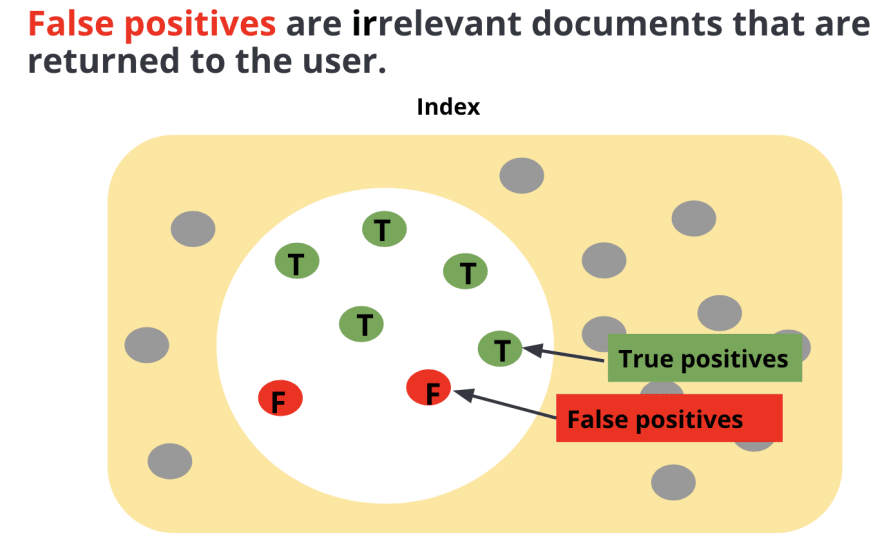

You probably had an experience where you searched for something and some of the results were not relevant to what you were looking for.

These are known as false positives. These are irrelevant search results that were retrieved by the Search engine for some reason.

**What are true negatives?**

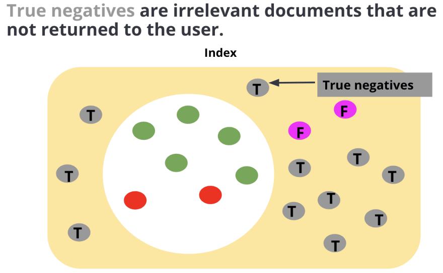

Let’s focus on the dots in the yellow region of this diagram. These are the documents that were not returned by the search engine.

Some of documents that were not returned by the search engine are truly irrelevant to the search query and were correctly rejected by the search engine. These are known as true negatives.

**What are false negatives?**

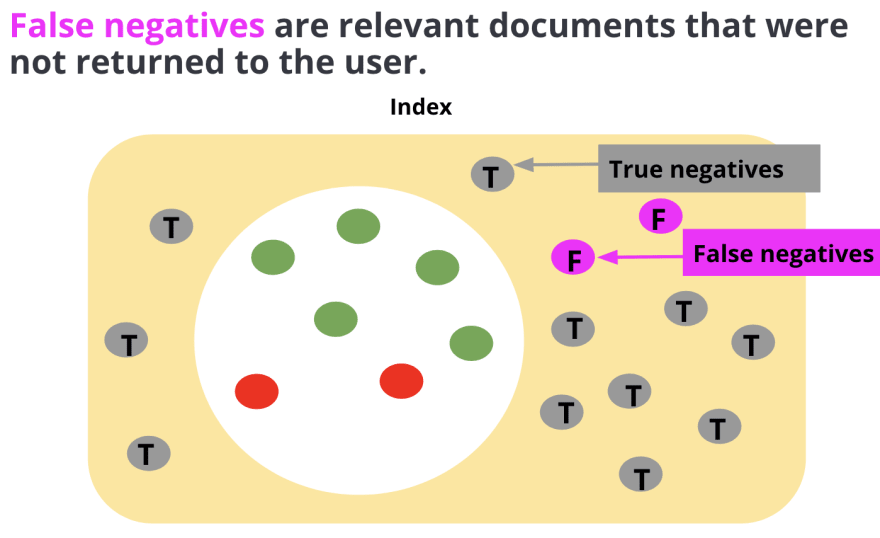

Among the rejected documents, there may be relevant documents that should have been returned in the response. These are known as false negatives. 

**Precision**

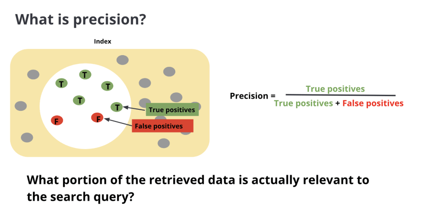

**Precision** is calculated by true positives divided by the sum of true positives and false positives. Precision tells you what portion of the retrieved data is actually relevant to the search query. 

**Recall**	

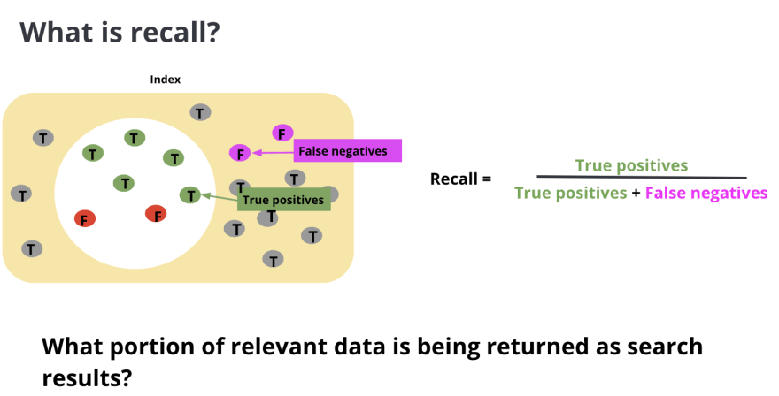

**Recall** on the other hand is calculated by true positives divided by the sum of true positives and false negatives. It tells you what portion of relevant data is being returned as search results.

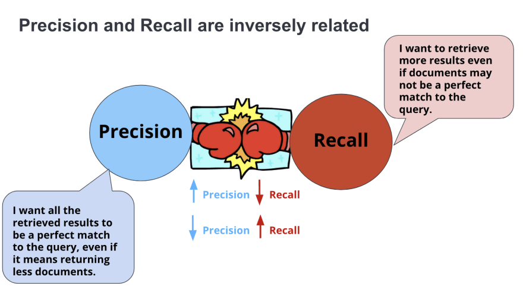

**Precision** and **recall** are inversely related.

**Precision** wants all the retrieved results to a perfect match to the query, even if it means returning less or no documents.

Whereas **recall** focuses more on quantity. It wants to retrieve more results even if the documents may not be a perfect match to the query. The dilemma is that we want to present the really relevant items but we also want to retrieve as many results as possible.

As you can see, these two factors are at odds with each other because if you want to improve **precision**, it might cause a decline in **recall** and vice versa.

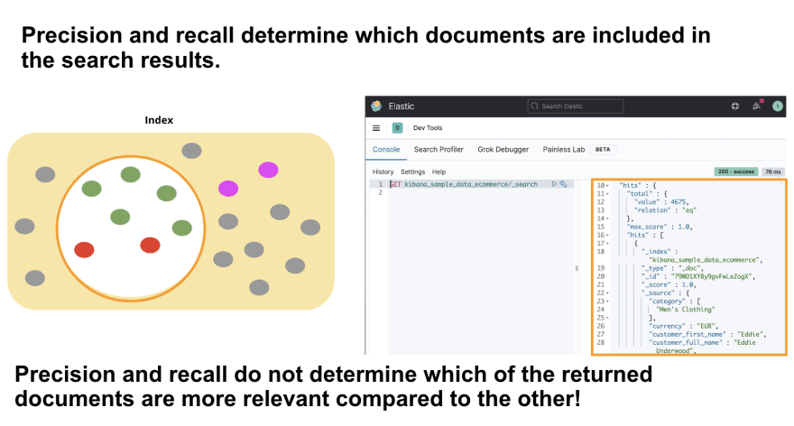

Let’s recap real quick! **Precision** and **recall** determine which documents are included in the search results. However, **precision** and **recall** do not determine which of these returned documents are more relevant than the other.

This is determined by **ranking**! 

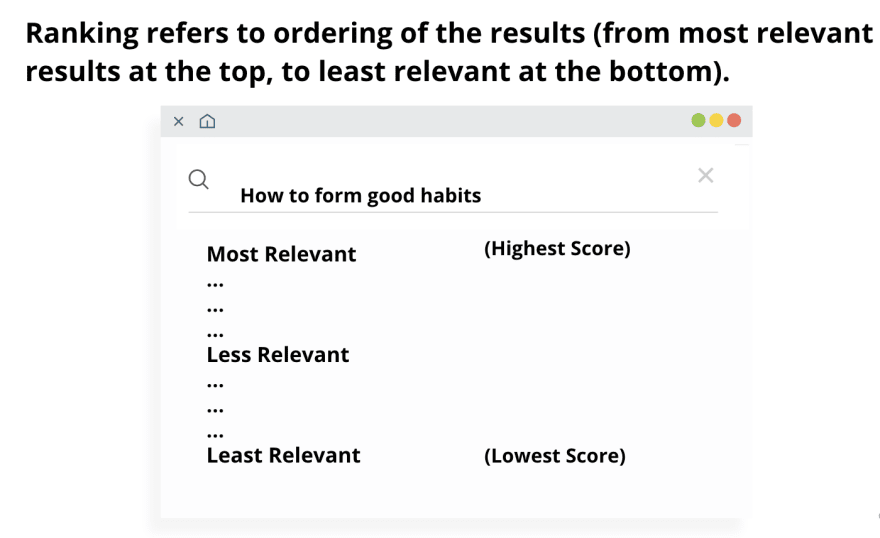

When you look at your search results, you will see that the most relevant results are at the top and the least relevant are at the bottom.

This **ranking** or order is determined by a scoring algorithm.

Each result is given a **score**. Ones with the highest scores are displayed at the top whereas ones with the lowest scores are displayed at the bottom. 

**What is score?**

**Score** is a value that represents how relevant a document is to that specific query. A score is computed for each document that is a hit, and hits are search results that are sent to the user. 

The higher the score a document has, more relevant the document is to the query, and it’s going to end up higher in the order!

**How is a score calculated?**

There are multiple factors that are used to compute a document's score. we focus on **term frequency(TF)** and **inverse document frequency(IDF)**.

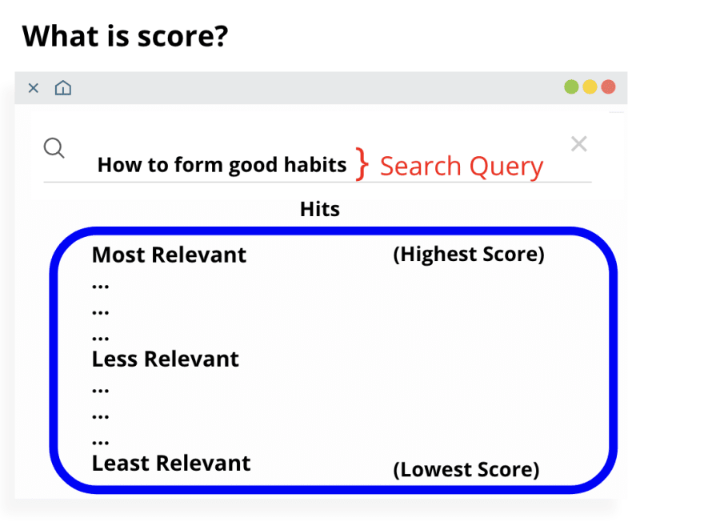

When you search for something, you type in a search query in the search box. Elasticsearch looks at the query and pulls up relevant documents or hits.Then, it calculates a score for each document and ranks them by relevance.

So how does this happen? 

**What is term frequency?**

Let’s talk about how **term frequency** plays a role in calculating a score.

In the image below, we have a search query(red bracket) “ how to form good habits”. This query is made of multiple search terms(blue arrows).

When the relevant documents are retrieved, Elasticsearch looks through these documents and calculates how many times each search term appears in a document.

This is known as **term frequency**. 

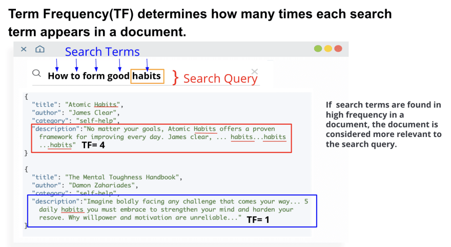

If a document mentions search terms more frequently, Elasticsearch assumes that this document is more relevant to the search query and it assigns a higher score to the document.

Let’s say we were looking at the frequency for the term habits(orange box).

In the field description of the first document(red box), the term habits appears 4 times(TF=4). In the field description of the the second document(blue box), the term habits appears 1 time(TF=1).

Therefore, in this example, the first document will be given a higher score and end up higher on the search results.

**What is Inverse Document Frequency(IDF)?**

When we calculate a score based on **term frequency** alone, this will not give us the most relevant documents. This happens because **term frequency** considers all search terms to be equally important when assessing the relevance of a document.

Let’s look at the search query in the image below.

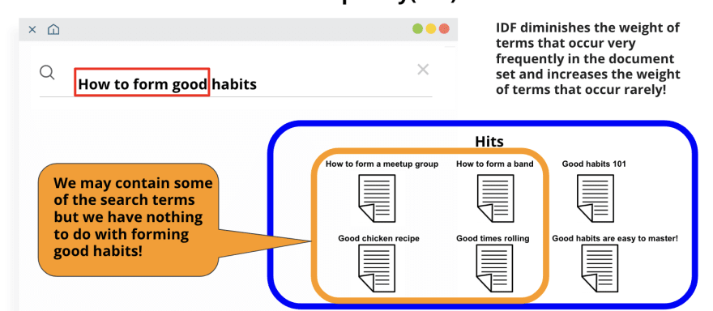 

We have search terms, "how" and "to" and "form" and "good" and "habits". Not all of these search terms will help you determine the relevance of a document.

For example, the first four search terms are commonly seen in many, if not all documents. Take a look at the hits(blue box), then at the documents highlighted with an orange box.

The documents like "how to form a meetup group" or "good chicken recipes" do contain some of the search terms. But these documents are completely irrelevant to what we are looking for!

But because of **term frequency**, if these commonly found search terms were found in high frequency in any of these documents, these documents will end up with high scores, even though these are irrelevant to the query.

So Elasticsearch offsets this with **inverse document frequency(IDF)**. With Elasticsearch, if certain search terms are found in many documents in the result set, it knows that these terms are not useful at determining relevance.

When Elasticsearch goes through all the hits, it will reduce the score for documents with unimportant search terms. It will also increase the score for documents with important search term like habits.

