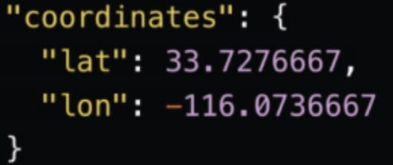
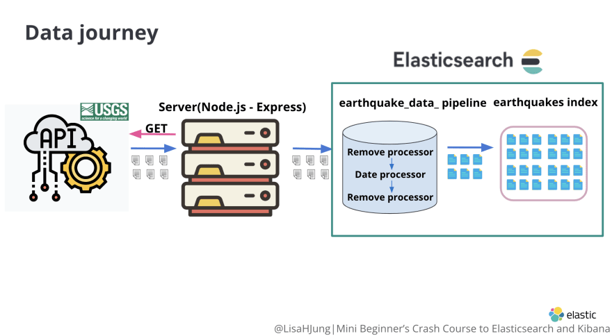

### Set up Elasticsearch for data transformation and data ingestion

We will accomplish two tasks:

1. create an **ingest pipeline** to transform the retrieved data

2. create an index called **earthquakes** with the desired mapping

#### Step 1: Review the data transformation requirements

Our **ingest pipeline** will be used to transform the data retrieved from the USGS API.

Before we create an **ingest pipeline**, let's review what changes we want to make to the data.

- remove the unnecessary info from the retrieved data

- change the Unix epoch time in the field **time** to human readable timestamp

- create fields **coordinates.lat** and **coordinates.lon** as shown below

#### Step 2: Create an ingest pipeline

Ingest pipelines can be created and managed via Kibana's **Ingest Pipelines** feature or the **ingest APIs**.

We will be using Kibana to create this pipeline.

From the Kibana home page, click on the **Stack Management** option.

From the **Stack Management page**, click on the **Ingest Pipelines** option.

Click on the **Create pipeline** option and select the **New pipeline** option from the drop down menu.

Name your pipeline to **earthquake_data_pipeline**.

#### Step 3: Add the desired processors to the pipeline

Click on the **Add a processor** option.

##### Task 1: Remove the fields that we do not need from the retrieved data

Here is an example of an earthquake object from the USGS earthquake API:

   {
     "type":"Feature",
     "properties":{
        "mag":1.13,
        "place":"11km ENE of Coachella, CA",
        "time":1650316843970,
        "updated":1650317059011,
        "tz":null, 
        "url":"https://earthquake.usgs.gov/earthquakes/eventpage/ci40240408",
        "detail":"https://earthquake.usgs.gov/earthquakes/feed/v1.0/detail/ci40240408.geojson",                
        "felt":null,
        "cdi":null,
        "mmi":null,
        "alert":null,
        "status":"automatic",
        "tsunami":0,
        "sig":20,
        "net":"ci",
        "code":"40240408",
        "ids":",ci40240408,",
        "sources":",ci,",
        "types":",nearby-cities,origin,phase-data,scitech-link,",
        "nst":37,
        "dmin":0.07687,
        "rms":0.26,
        "gap":48,
        "magType":"ml",
        "type":"earthquake",
        "title":"M 1.1 - 11km ENE of Coachella, CA"
     },
     "geometry":{
        "type":"Point",
        "coordinates":[
          -116.0736667,
          33.7276667,
          2.09
        ]

    },
     "id":"ci40240408"
   }

The following is a sample document with the desired fields we want to store in Elasticsearch.

{
  "mag": 1.13,
  "place": "11km ENE of Coachella, CA",
  "time": 2022-05-02T20:07:53.266Z,
  "url": "https://earthquake.usgs.gov/earthquakes/eventpage/ci40240408",
  "sig": 20,
  "type": "earthquake",
  "depth": 2.09,
  "coordinates": {
    "lat": 33.7276667,
    "lon": -116.0736667
  }
}

Here is the list of fields that we do not need.

- updated
- tz
- detail
- felt
- cdi
- mmi
- alert
- status
- tsunami
- net
- code
- ids
- sources
- types
- nst
- dmin
- rms
- gap
- magType
- title

> "updated","tz","detail","felt","cdi","mmi","alert","status","tsunami","net","code","ids","sources","types","nst","dmin","rms","gap","magType","title"

To remove these fields, we can use the **Remove** processor.

Under the processor section, type **Remove** in the search bar. Click on the **Remove** processor

In the **Fields** section, we will add the names of the fields that we wish to remove.
 
Activate the **Ignore missing** option.
 
Click on the **Add** button.
 
You will see that the **Remove** processor has been added to the **earthquake_data_pipeline**.
 
##### Task 2: Change the Unix epoch time in the field **time** to human readable timestamp

In order to make this change, you should use the **date** processor.

The **date** processor converts time from one format to another.

Click on the **Add a processor** option.

Under the **Processor** section, type in **Date** and click on the **Date** option from the drop down menu.

In the **Field** section, type the name of the field we wish to convert (**time**).

In the **Formats** section, we will specify the desired date formats. The format shown in the results card is called **UNIX_MS**.

Type it into this section and hit enter. Then, click on the **Add** button to add the **date** processor to the **ingest pipeline**.

You will see that the **Date** processor has been added to the **earthquake_data_pipeline**.
 
When the data goes through the **date** processor, the content of the field **time** will be converted to the **UNIX_MS** format then stored in a new field called **@timestamp**.

After this process is finished, we do not need the original field **time**. Therefore, we will remove the field **time** after the data goes through the **date** processor.

From the **Create pipeline** page, click on the **Add a processor** option.

Under the **Processor** section, type in **Remove** and hit enter.

Under the **Fields** section, type in **time** and hit enter. Activate the **ignore missing** option. Then, click on the **Add** .

##### Task 3: Create fields called coordinates.lat and coordinates.lon

From the same page, click on the **Add a processor** option.

Under the **processor** section, type in **Rename** and hit enter.

Under the **Field** section, type in **latitude**. Under the **Target** field section, type in **coordinates.lat**.

This step will rename the field **latitude** in the incoming data to **coordinates.lat**.

Activate the **Ignore missing** option then click on the **Add** button to add this processor to the **earthquake_data_pipeline**.

Next, we will repeat the same process to add a Rename processor to rename the field **longitude** from the incoming data to **coordinates.lon**.

We have added all the necessary processors to transform our data.

Before creating the **earthquake_data_pipeline**, make sure the order of the processors are listed in the order you want them to run.

Next, we will create the **earthquake_data_pipeline** by clicking on the **Create pipeline** button.

##### Final ingest pipeline

PUT _ingest/pipeline/earthquake_data_pipeline
{
  "description": "My optional pipeline description",
  "processors": [
    {
      "date": {
        "field": "properties.time",
        "formats": [
          "UNIX_MS"
        ]
      }
    },
    {
      "remove": {
        "field": [
          "type"
        ],
        "ignore_missing": true
      }
    },
    {
      "script": {
        "source": "ctx['coordinates'] = [ctx.geometry.coordinates.get(0), ctx.geometry.coordinates.get(1)];\nctx['depth'] = ctx.geometry.coordinates.get(2);"
      }
    },
    {
      "rename": {
        "field": "latitude",
        "target_field": "coordinates.lat",
        "ignore_missing": true
      }
    },
    {
      "rename": {
        "field": "longitude",
        "target_field": "coordinates.lon",
        "ignore_missing": true
      }
    },
    {
      "rename": {
        "field": "properties.mag",
        "target_field": "mag",
        "ignore_missing": true
      }
    },
    {
      "rename": {
        "field": "properties.place",
        "target_field": "place",
        "ignore_missing": true
      }
    },
    {
      "rename": {
        "field": "properties.url",
        "target_field": "url",
        "ignore_missing": true
      }
    },
    {
      "rename": {
        "field": "properties.sig",
        "target_field": "sig",
        "ignore_missing": true
      }
    },
    {
      "rename": {
        "field": "properties.type",
        "target_field": "type",
        "ignore_missing": true
      }
    },
    {
      "set": {
        "field": "_id",
        "value": "{{{id}}}"
      }
    },
    {
      "remove": {
        "field": [
          "geometry",
          "id",
          "properties"
        ],
        "ignore_missing": true
      }
    }
  ]
}

curl -XPUT "http://localhost:9200/_ingest/pipeline/earthquake_data_pipeline?pretty" -H 'Content-Type: application/json' -d'
{
  "description": "My optional pipeline description",
  "processors": [
    {
      "date": {
        "field": "properties.time",
        "formats": [
          "UNIX_MS"
        ]
      }
    },
    {
      "remove": {
        "field": [
          "type"
        ],
        "ignore_missing": true
      }
    },
    {
      "script": {
        "source": "ctx['coordinates'] = [ctx.geometry.coordinates.get(0), ctx.geometry.coordinates.get(1)];\nctx['depth'] = ctx.geometry.coordinates.get(2);"
      }
    },
    {
      "rename": {
        "field": "latitude",
        "target_field": "coordinates.lat",
        "ignore_missing": true
      }
    },
    {
      "rename": {
        "field": "longitude",
        "target_field": "coordinates.lon",
        "ignore_missing": true
      }
    },
    {
      "rename": {
        "field": "properties.mag",
        "target_field": "mag",
        "ignore_missing": true
      }
    },
    {
      "rename": {
        "field": "properties.place",
        "target_field": "place",
        "ignore_missing": true
      }
    },
    {
      "rename": {
        "field": "properties.url",
        "target_field": "url",
        "ignore_missing": true
      }
    },
    {
      "rename": {
        "field": "properties.sig",
        "target_field": "sig",
        "ignore_missing": true
      }
    },
    {
      "rename": {
        "field": "properties.type",
        "target_field": "type",
        "ignore_missing": true
      }
    },
    {
      "set": {
        "field": "_id",
        "value": "{{{id}}}"
      }
    },
    {
      "remove": {
        "field": [
          "geometry",
          "id",
          "properties"
        ],
        "ignore_missing": true
      }
    }
  ]
}'

POST _ingest/pipeline/earthquake_data_pipeline/_simulate
{
  "docs": [
    {
      "_source": {
        "type": "Feature",
        "properties": {
          "mag": 1.13,
          "place": "11km ENE of Coachella, CA",
          "time": 1650316843970,
          "updated": 1650317059011,
          "tz": null,
          "url": "https://earthquake.usgs.gov/earthquakes/eventpage/ci40240408",
          "detail": "https://earthquake.usgs.gov/earthquakes/feed/v1.0/detail/ci40240408.geojson",
          "felt": null,
          "cdi": null,
          "mmi": null,
          "alert": null,
          "status": "automatic",
          "tsunami": 0,
          "sig": 20,
          "net": "ci",
          "code": "40240408",
          "ids": ",ci40240408,",
          "sources": ",ci,",
          "types": ",nearby-cities,origin,phase-data,scitech-link,",
          "nst": 37,
          "dmin": 0.07687,
          "rms": 0.26,
          "gap": 48,
          "magType": "ml",
          "type": "earthquake",
          "title": "M 1.1 - 11km ENE of Coachella, CA"
        },
        "geometry": {
          "type": "Point",
          "coordinates": [
            -116.0736667,
            33.7276667,
            2.09
          ]
        },
        "id": "ci40240408"
      }
    }
  ]
}

##### Step 4: Create an index called earthquakes with the desired mapping

We will accomplish this step using **Kibana Dev Tools**.

In the left panel of the Kibana console, copy and paste the following.

> PUT earthquakes 
> {
>   "mappings": {
>     "properties": {
>       "@timestamp": {
>         "type": "date"
>       },
>       "coordinates": {
>         "type": "geo_point"
>       },
>       "depth": {
>         "type": "float"
>       },
>       "mag": {
>         "type": "float"
>       },
>       "place": {
>         "type": "text",
>         "fields": {
>           "keyword": {
>             "type": "keyword"
>           }
>         }
>       },
>       "sig": {
>         "type": "short"
>       },
>       "type": {
>         "type": "keyword"
>       },
>       "url": {
>         "type" : "object",
>         "enabled": false
>       }
>     }
>   }
> }

OR

> curl -XPUT "http://localhost:9200/earthquakes?pretty" -H 'Content-Type: application/json' -d'
> {
>   "mappings": {
>     "properties": {
>       "@timestamp": {
>         "type": "date"
>       },
>       "coordinates": {
>         "type": "geo_point"
>       },
>       "depth": {
>         "type": "float"
>       },
>       "mag": {
>         "type": "float"
>       },
>       "place": {
>         "type": "text",
>         "fields": {
>           "keyword": {
>             "type": "keyword"
>           }
>         }
>       },
>       "sig": {
>         "type": "short"
>       },
>       "type": {
>         "type": "keyword"
>       },
>       "url": {
>         "type" : "object",
>         "enabled": false
>       }
>     }
>   }
> }'

##### Submitting bulk requests with cURL

> cat > ingest_earthquakes.sh <<EOF
> #!/bin/bash
> content=$(curl -sS https://earthquake.usgs.gov/earthquakes/feed/v1.0/summary/all_month.geojson)
> echo $content | jq -c  '.features[]' > all_month.geojson.ndjson
> sed -i 's/^/{"index":{}}\n/'  all_month.geojson.ndjson
> curl -s -H "Content-Type: application/x-ndjson" -XPOST "localhost:9200/earthquakes/_bulk?pipeline=earthquake_data_pipeline" --data-binary "@all_month.geojson.ndjson"; echo
> rm -rf all_month.geojson.ndjson
> EOF

**Note:** If you’re providing text file input to curl, you must use the --data-binary flag instead of plain -d. The latter doesn’t preserve newlines. 

#### NOTE:

> jq -c '.[]' <<END
> {
>     [
>         {
>             "a1": 1
>         },
>         {
>             "a2": 2
>         }
>     ]
> }
> END

> jq -c '.a | .[]' <<END
> {
>     "a": [
>         {
>             "a1": 1
>         },
>         {
>             "a2": 2
>         }
>     ]
> }
> END

#### Summary

We have created:
curl -sS https://earthquake.usgs.gov/earthquakes/feed/v1.0/summary/all_month.geojson
- an **ingest pipeline**(earthquake_data_pipeline) to transform the retrieved data from the USGS API

- an index called **earthquakes** with the desired mapping

Next , we will set up the server to retrieve earthquake data from the USGS API and send the data to the **earthquake_data_pipeline** in Elasticsearch.

Once the data transformation is complete, the transformed data will be ingested into the **earthquakes** index.

#### Dashboard

[Earthquakes Data Visualization](earthquakes_data_visualization.ndjson)

