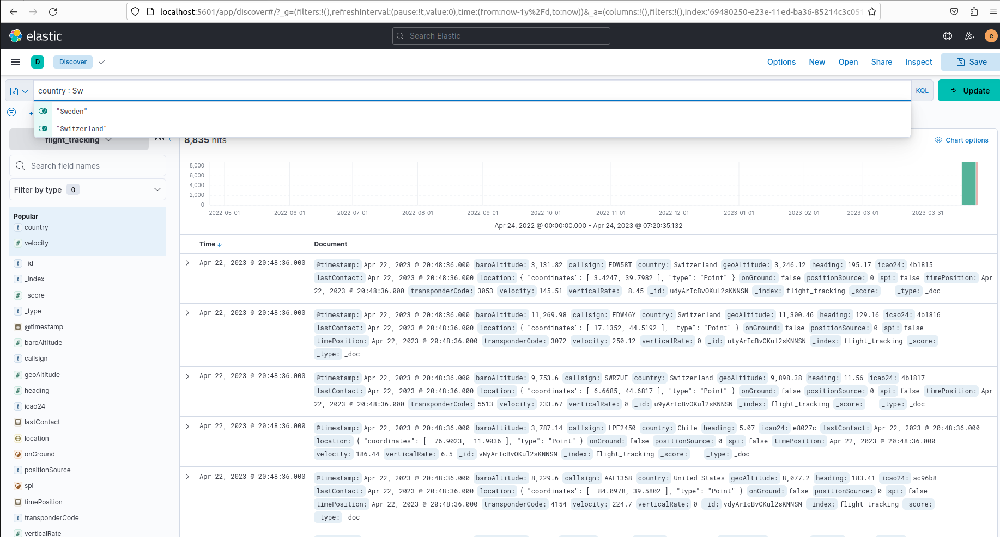

### Kibana Search

#### Lucene

To change the language to Lucene, click the `KQL` button in the search bar. Change the `Kibana Query Language` option to `Off`	.

##### Text Search

Single Word Query

Multiword Query

String Query

##### Field Search

Available fields:: 

Search Field for Exact Phrase

Serch Field Multi valie

Search Field Range

##### Boolean Queries

**AND:**

**\[X TO Y\]:**

**\[X TO \*\]:**

**AND / OR:**

#### Kibana Filter

**1.** Create a filter by clicking the `+Add filter` link.
 

**2.** Select a `Field` from the dropdown menu or start searching to get autosuggestions.

**3.** Choose an `Operator` from the dropdown menu.

**4.** An additional `Value` field appears depending on the chosen operator. The `exists` and `does not exist` options do not require the `Value` field while all other operators do. 

**5.** As an optional step, create a custom label for the filter. Tick the `Create custom label?` checkbox and provide a name. Click Save to finish.

**Add** multiple filters to narrow the dataset search further.

 You can preform `Pin/Edit/Exclude results/Disable/Delete` actions for filters.

#### KQL

 

 

 

 

 

 

 

 

 

 

 

 

 

