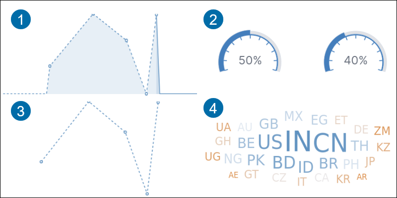
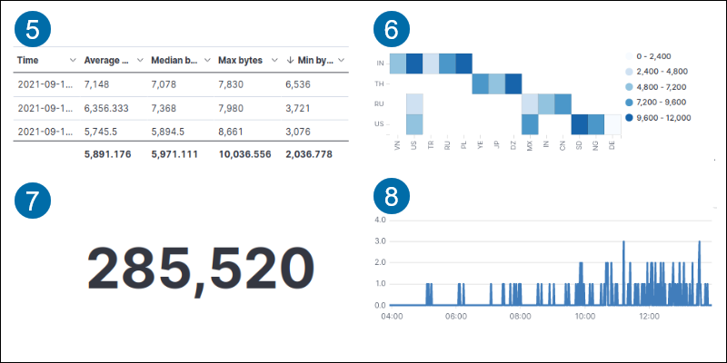
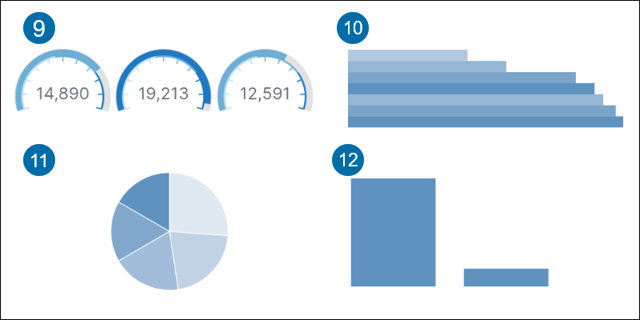

### Kibana Search

#### KQL and Lucene

##### Text Search

Single Word Query

Multiword Query

String Query

##### Field Search

Available fields:: 

Search Field for Exact Phrase

Serch Field Multi valie

Search Field Range

##### Boolean Queries

**AND:**

**\[X TO Y\]:**

**\[X TO *\]:**

**AND / OR:**

#### Kibana Filter

### Kibana Aggregations

The Kibana aggregation tool provides various visualizations:

1. Area highlights data between an axis and a line.

2. Goal tracks the metric progress to a specified goal.

3. Line displays data as a series of points.

4. Tag cloud shows word frequency.

5. Data table shows data in rows and columns.

6. Heat map displays data in a cell-matrix with shaded regions.

7. Metric shows a calculation result as a single number.

8. Timelion graphs time series data.

9. Gauge shows a metric status.

10. Horizontal bar displays data in horizontal bars on an axis.

11. Pie compares data in portions compared to a whole.

12. Vertical bar shows data in a vertical bar on an axis.

