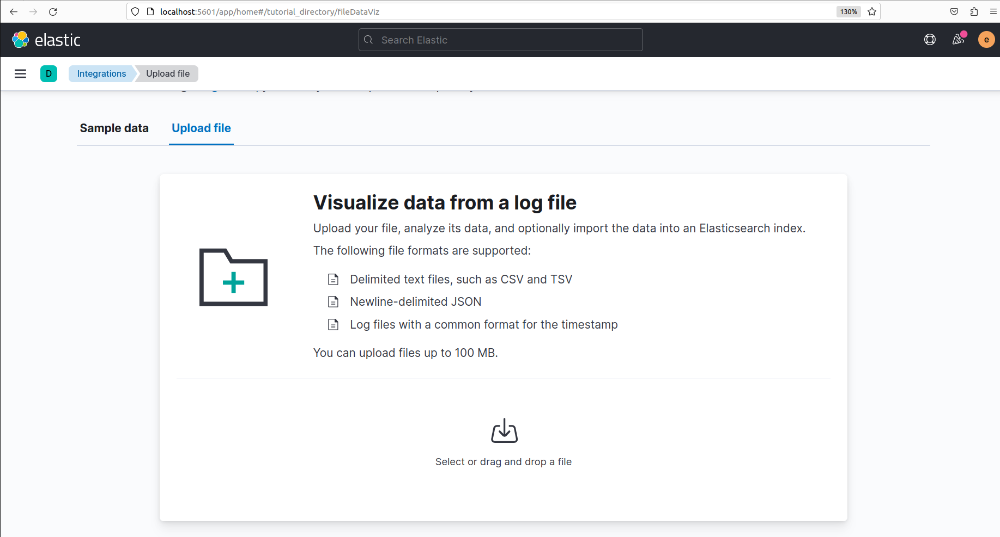
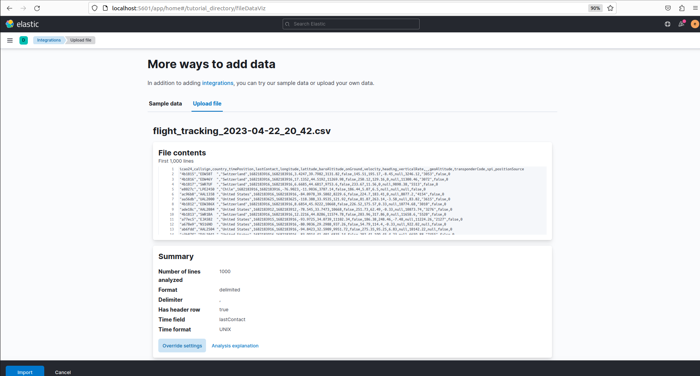
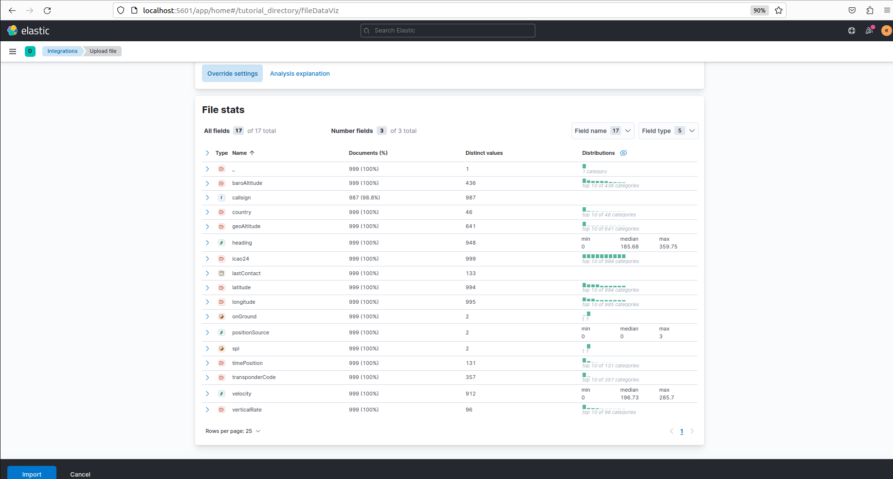
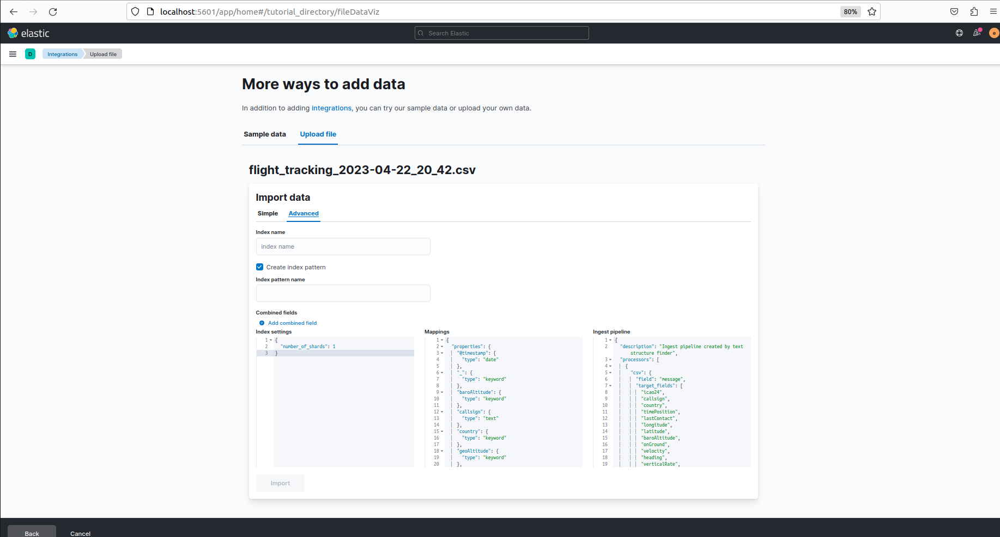
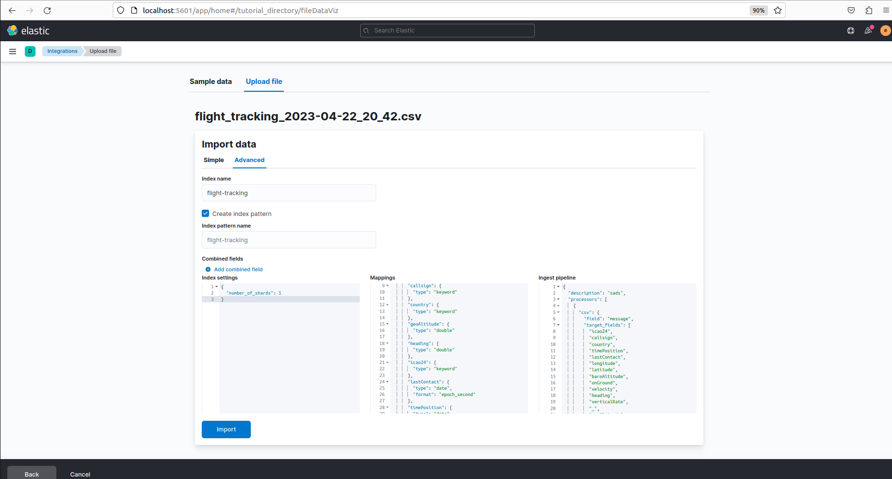
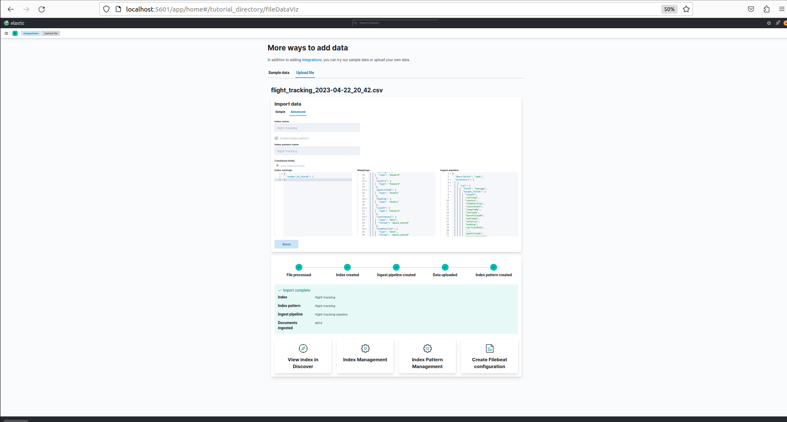
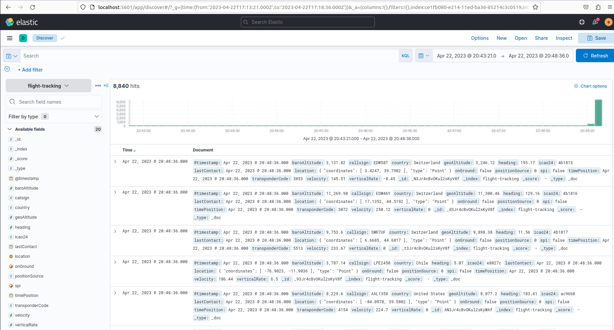

### Ingest with kibana `upload a file` feture

#### Run Elastic Stack

```

docker-compose down -v
docker compose up -d

```
#### Download opensky states

The script makes a request to OpenSky API and appends to a CSV file the contents. Once the file is generate it will use ogr2ogr to convert the CSV into a GeoJSON file.

```json

cat > dataset/data_header.csv <<EOF
icao24,callsign,country,timePosition,lastContact,longitude,latitude,baroAltitude,onGround,velocity,heading,verticalRate,_,geoAltitude,transponderCode,spi,positionSource
EOF

filename_base=flight_tracking_$(date "+%Y-%m-%d_%H_%M")

csv_file="${filename_base}.csv"
geojson_file="${filename_base}.geojson"

cat dataset/data_header.csv > dataset/${csv_file}
curl -sL "https://opensky-network.org/api/states/all" \
      | jq -c ".states[]" \
      | sed -e 's/^\[//g' -e 's/\]$//g' \
      >> dataset/${csv_file}

ogr2ogr -f GeoJSON dataset/${geojson_file} \
  -oo "X_POSSIBLE_NAMES=Lon*" \
  -oo "Y_POSSIBLE_NAMES=Lat*" \
  -oo KEEP_GEOM_COLUMNS=NO \
  dataset/${csv_file}

```

#### Ingest documents

Go to Home page `http://localhost:5601/app/home#/` and then click on `upload a file` link


In `upload file` tap click on `select or drag and drop a file` and select file you want to upload(`flight_tracking_2023-04-22_20_42.csv`).




Then click `import` button.



</br>
</br>



</br>
Then choose `Advanced` tap for customizing import like index name, mapping, pipeline.


</br>
In `Advanced` tab:

- In `index name` text box enter `flight_tracking`.
- In `Mappings` text area enter `flight_tracking` mapping [from here](#flight-tracking-mappings).
- In `Ingest pipeline` text area enter pipeline [from here](#flight-tracking-ingest-pipeline).

Then click `import` button.



</br>



</br>
Import complated .Now you can explotre your data.for thiss clike on `Viwe index in Discover`.



</br>
In discover



</br>
A single document


#### Flight tracking mappings

flight_tracking  mapping is in `mappings/flight-tracking.mappings.json` file:

```json

{
  "mappings": {
    "properties": {
      "@timestamp": {
        "type": "date"
      },
      "baroAltitude": {
        "type": "double"
      },
      "callsign": {
        "type": "keyword"
      },
      "country": {
        "type": "keyword"
      },
      "geoAltitude": {
        "type": "double"
      },
      "heading": {
        "type": "double"
      },
      "icao24": {
        "type": "keyword"
      },
      "lastContact": {
        "type": "date",
        "format": "epoch_second"
      },
      "timePosition": {
        "type": "date",
        "format": "epoch_second"
      },
      "onGround": {
        "type": "boolean"
      },
      "positionSource": {
        "type": "keyword"
      },
      "spi": {
        "type": "boolean"
      },
      "transponderCode": {
        "type": "keyword"
      },
      "velocity": {
        "type": "double"
      },
      "verticalRate": {
        "type": "double"
      },
      "location": {
        "type": "geo_point"
      }
    }
  }
}

```

#### Flight tracking ingest pipeline

```json

{
  "description": "sads",
  "processors": [
    {
      "csv": {
        "field": "message",
        "target_fields": [
          "icao24",
          "callsign",
          "country",
          "timePosition",
          "lastContact",
          "longitude",
          "latitude",
          "baroAltitude",
          "onGround",
          "velocity",
          "heading",
          "verticalRate",
          "_",
          "geoAltitude",
          "transponderCode",
          "spi",
          "positionSource"
        ],
        "ignore_missing": false
      }
    },
    {
      "remove": {
        "ignore_missing": true,
        "field": "icao24",
        "if": "ctx?.icao24 == null || ctx?.icao24 == '' || ctx?.icao24 == 'null'"
      }
    },
    {
      "remove": {
        "ignore_missing": true,
        "field": "callsign",
        "if": "ctx?.callsign == null || ctx?.callsign == '' || ctx?.callsign == 'null'"
      }
    },
    {
      "remove": {
        "ignore_missing": true,
        "field": "country",
        "if": "ctx?.country == null || ctx?.country == '' || ctx?.country == 'null'"
      }
    },
    {
      "remove": {
        "ignore_missing": true,
        "field": "timePosition",
        "if": "ctx?.timePosition == null || ctx?.timePosition == '' || ctx?.timePosition == 'null'"
      }
    },
    {
      "remove": {
        "ignore_missing": true,
        "field": "lastContact",
        "if": "ctx?.lastContact == null || ctx?.lastContact == '' || ctx?.lastContact == 'null'"
      }
    },
    {
      "remove": {
        "ignore_missing": true,
        "field": "longitude",
        "if": "ctx?.longitude == null || ctx?.longitude == '' || ctx?.longitude == 'null'"
      }
    },
    {
      "remove": {
        "ignore_missing": true,
        "field": "latitude",
        "if": "ctx?.latitude == null || ctx?.latitude == '' || ctx?.latitude == 'null'"
      }
    },
    {
      "remove": {
        "ignore_missing": true,
        "field": "baroAltitude",
        "if": "ctx?.baroAltitude == null || ctx?.baroAltitude == '' || ctx?.baroAltitude == 'null'"
      }
    },
    {
      "remove": {
        "ignore_missing": true,
        "field": "onGround",
        "if": "ctx?.onGround == null || ctx?.onGround == '' || ctx?.onGround == 'null'"
      }
    },
    {
      "remove": {
        "ignore_missing": true,
        "field": "velocity",
        "if": "ctx?.velocity == null || ctx?.velocity == '' || ctx?.velocity == 'null'"
      }
    },
    {
      "remove": {
        "ignore_missing": true,
        "field": "heading",
        "if": "ctx?.heading == null || ctx?.heading == '' || ctx?.heading == 'null'"
      }
    },
    {
      "remove": {
        "ignore_missing": true,
        "field": "verticalRate",
        "if": "ctx?.verticalRate == null || ctx?.verticalRate == '' || ctx?.verticalRate == 'null'"
      }
    },
    {
      "remove": {
        "ignore_missing": true,
        "field": "geoAltitude",
        "if": "ctx?.geoAltitude == null || ctx?.geoAltitude == '' || ctx?.geoAltitude == 'null'"
      }
    },
    {
      "remove": {
        "ignore_missing": true,
        "field": "transponderCode",
        "if": "ctx?.transponderCode == null || ctx?.transponderCode == '' || ctx?.transponderCode == 'null'"
      }
    },
    {
      "remove": {
        "ignore_missing": true,
        "field": "spi",
        "if": "ctx?.spi == null || ctx?.spi == '' || ctx?.spi == 'null'"
      }
    },
    {
      "remove": {
        "ignore_missing": true,
        "field": "positionSource",
        "if": "ctx?.positionSource == null || ctx?.positionSource == '' || ctx?.positionSource == 'null'"
      }
    },
    {
      "date": {
        "field": "timePosition",
        "formats": [
          "UNIX"
        ]
      }
    },
    {
      "convert": {
        "field": "baroAltitude",
        "type": "double",
        "ignore_missing": true
      }
    },
    {
      "convert": {
        "field": "geoAltitude",
        "type": "double",
        "ignore_missing": true
      }
    },
    {
      "convert": {
        "field": "heading",
        "type": "double",
        "ignore_missing": true
      }
    },
    {
      "convert": {
        "field": "latitude",
        "type": "double",
        "ignore_missing": true
      }
    },
    {
      "convert": {
        "field": "longitude",
        "type": "double",
        "ignore_missing": true
      }
    },
    {
      "convert": {
        "field": "velocity",
        "type": "double",
        "ignore_missing": true
      }
    },
    {
      "convert": {
        "field": "verticalRate",
        "type": "double",
        "ignore_missing": true
      }
    },
    {
      "date": {
        "field": "lastContact",
        "formats": [
          "UNIX"
        ]
      }
    },
    {
      "convert": {
        "field": "onGround",
        "type": "boolean",
        "ignore_missing": true
      }
    },
    {
      "convert": {
        "field": "spi",
        "type": "boolean",
        "ignore_missing": true
      }
    },
    {
      "set": {
        "field": "location",
        "value": "{{latitude}},{{longitude}}"
      }
    },
    {
      "remove": {
        "field": [
          "message",
          "_",
          "latitude",
          "longitude"
        ]
      }
    }
  ],
 "on_failure": [
    {
      "set": {
        "description": "Index document to 'failed-<index>'",
        "field": "_index",
        "value": "failed-{{{ _index }}}"
      }
    },
    {
      "set": {
        "description": "Record error information",
        "field": "error_information",
        "value": "Processor {{ _ingest.on_failure_processor_type }} with tag {{ _ingest.on_failure_processor_tag }} in pipeline {{ _ingest.on_failure_pipeline }} failed with message {{ _ingest.on_failure_message }}"
      }      
    }
  ]  
}

```

#### simulation

```json

POST /_ingest/pipeline/flight-tracking-ingest-pipeline/_simulate
{
  "docs": [
    {
        "_source" : {
          "message" : "\"4b1815\",\"EDW58T  \",\"Switzerland\",1682183916,1682183916,3.4247,39.7982,3131.82,false,145.51,195.17,-8.45,null,3246.12,\"3053\",false,0"
        }
      }
  ]
}

```

**OR:**

```json

POST _ingest/pipeline/_simulate
{
  "pipeline": {
    "description": "sads",
    "processors": [
      {
        "csv": {
          "field": "message",
          "target_fields": [
            "icao24",
            "callsign",
            "country",
            "timePosition",
            "lastContact",
            "longitude",
            "latitude",
            "baroAltitude",
            "onGround",
            "velocity",
            "heading",
            "verticalRate",
            "_",
            "geoAltitude",
            "transponderCode",
            "spi",
            "positionSource"
          ],
          "ignore_missing": false
        }
      },
      {
        "remove": {
          "ignore_missing": true,
          "field": "icao24",
          "if": "ctx?.icao24 == null || ctx?.icao24 == '' || ctx?.icao24 == 'null'"
        }
      },
      {
        "remove": {
          "ignore_missing": true,
          "field": "callsign",
          "if": "ctx?.callsign == null || ctx?.callsign == '' || ctx?.callsign == 'null'"
        }
      },
      {
        "remove": {
          "ignore_missing": true,
          "field": "country",
          "if": "ctx?.country == null || ctx?.country == '' || ctx?.country == 'null'"
        }
      },
      {
        "remove": {
          "ignore_missing": true,
          "field": "timePosition",
          "if": "ctx?.timePosition == null || ctx?.timePosition == '' || ctx?.timePosition == 'null'"
        }
      },
      {
        "remove": {
          "ignore_missing": true,
          "field": "lastContact",
          "if": "ctx?.lastContact == null || ctx?.lastContact == '' || ctx?.lastContact == 'null'"
        }
      },
      {
        "remove": {
          "ignore_missing": true,
          "field": "longitude",
          "if": "ctx?.longitude == null || ctx?.longitude == '' || ctx?.longitude == 'null'"
        }
      },
      {
        "remove": {
          "ignore_missing": true,
          "field": "latitude",
          "if": "ctx?.latitude == null || ctx?.latitude == '' || ctx?.latitude == 'null'"
        }
      },
      {
        "remove": {
          "ignore_missing": true,
          "field": "baroAltitude",
          "if": "ctx?.baroAltitude == null || ctx?.baroAltitude == '' || ctx?.baroAltitude == 'null'"
        }
      },
      {
        "remove": {
          "ignore_missing": true,
          "field": "onGround",
          "if": "ctx?.onGround == null || ctx?.onGround == '' || ctx?.onGround == 'null'"
        }
      },
      {
        "remove": {
          "ignore_missing": true,
          "field": "velocity",
          "if": "ctx?.velocity == null || ctx?.velocity == '' || ctx?.velocity == 'null'"
        }
      },
      {
        "remove": {
          "ignore_missing": true,
          "field": "heading",
          "if": "ctx?.heading == null || ctx?.heading == '' || ctx?.heading == 'null'"
        }
      },
      {
        "remove": {
          "ignore_missing": true,
          "field": "verticalRate",
          "if": "ctx?.verticalRate == null || ctx?.verticalRate == '' || ctx?.verticalRate == 'null'"
        }
      },
      {
        "remove": {
          "ignore_missing": true,
          "field": "geoAltitude",
          "if": "ctx?.geoAltitude == null || ctx?.geoAltitude == '' || ctx?.geoAltitude == 'null'"
        }
      },
      {
        "remove": {
          "ignore_missing": true,
          "field": "transponderCode",
          "if": "ctx?.transponderCode == null || ctx?.transponderCode == '' || ctx?.transponderCode == 'null'"
        }
      },
      {
        "remove": {
          "ignore_missing": true,
          "field": "spi",
          "if": "ctx?.spi == null || ctx?.spi == '' || ctx?.spi == 'null'"
        }
      },
      {
        "remove": {
          "ignore_missing": true,
          "field": "positionSource",
          "if": "ctx?.positionSource == null || ctx?.positionSource == '' || ctx?.positionSource == 'null'"
        }
      },
      {
        "date": {
          "field": "timePosition",
          "formats": [
            "UNIX"
          ]
        }
      },
      {
        "convert": {
          "field": "baroAltitude",
          "type": "double",
          "ignore_missing": true
        }
      },
      {
        "convert": {
          "field": "geoAltitude",
          "type": "double",
          "ignore_missing": true
        }
      },
      {
        "convert": {
          "field": "heading",
          "type": "double",
          "ignore_missing": true
        }
      },
      {
        "convert": {
          "field": "latitude",
          "type": "double",
          "ignore_missing": true
        }
      },
      {
        "convert": {
          "field": "longitude",
          "type": "double",
          "ignore_missing": true
        }
      },
      {
        "convert": {
          "field": "velocity",
          "type": "double",
          "ignore_missing": true
        }
      },
      {
        "convert": {
          "field": "verticalRate",
          "type": "double",
          "ignore_missing": true
        }
      },
      {
        "date": {
          "field": "lastContact",
          "formats": [
            "UNIX"
          ]
        }
      },
      {
        "convert": {
          "field": "onGround",
          "type": "boolean",
          "ignore_missing": true
        }
      },
      {
        "convert": {
          "field": "spi",
          "type": "boolean",
          "ignore_missing": true
        }
      },
      {
        "set": {
          "field": "location",
          "value": "{{latitude}},{{longitude}}"
        }
      },
      {
        "remove": {
          "field": [
            "message",
            "_",
            "latitude",
            "longitude"
          ]
        }
      }
    ],
    "on_failure": [
      {
        "set": {
          "description": "Index document to 'failed-<index>'",
          "field": "_index",
          "value": "failed-{{{ _index }}}"
        }
      },
      {
        "set": {
          "description": "Record error information",
          "field": "error_information",
          "value": "Processor {{ _ingest.on_failure_processor_type }} with tag {{ _ingest.on_failure_processor_tag }} in pipeline {{ _ingest.on_failure_pipeline }} failed with message {{ _ingest.on_failure_message }}"
        }
      }
    ]
  },
  "docs": [
    {
      "_source": {
        "message": "null"
      }
    }
  ]
}

```

