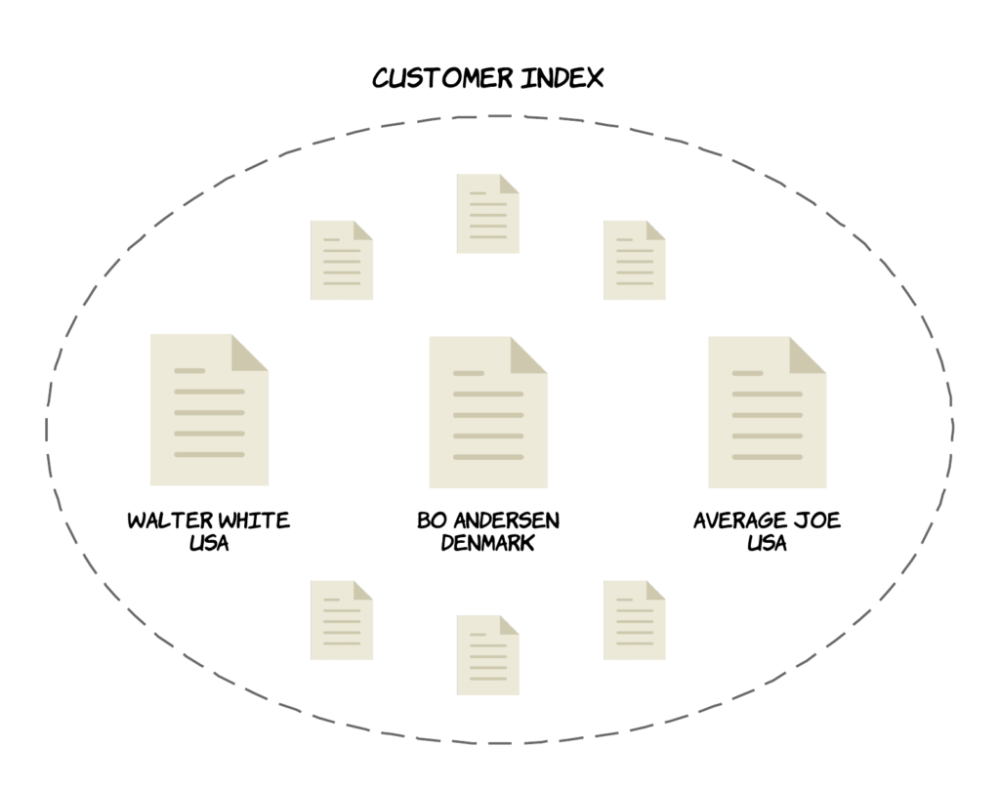
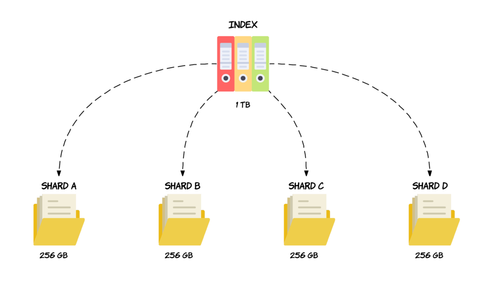
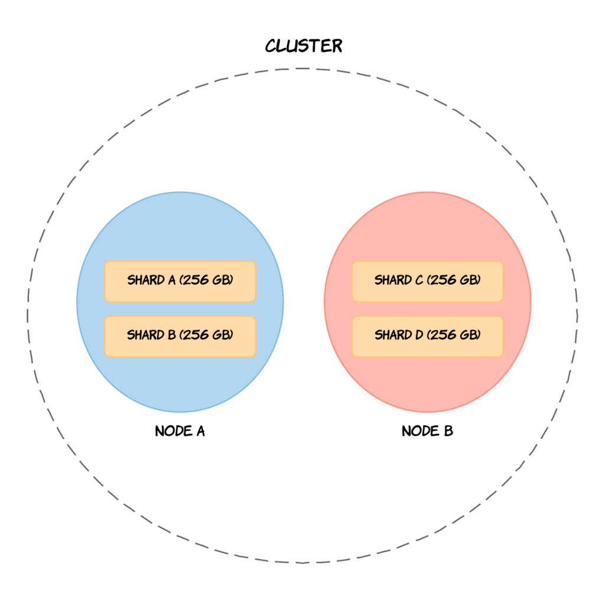
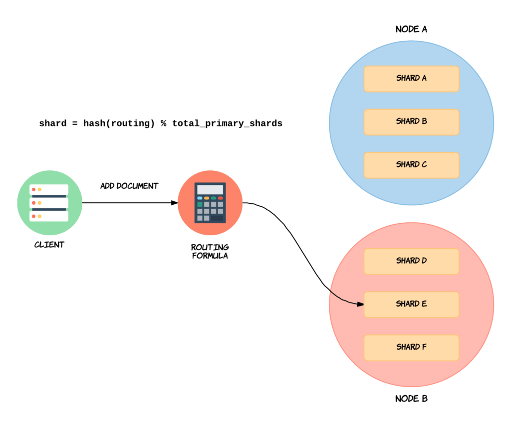
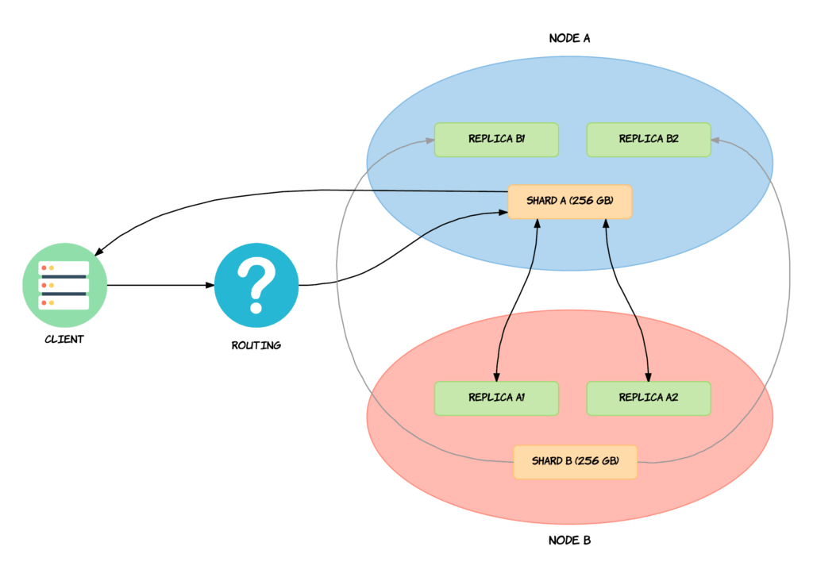
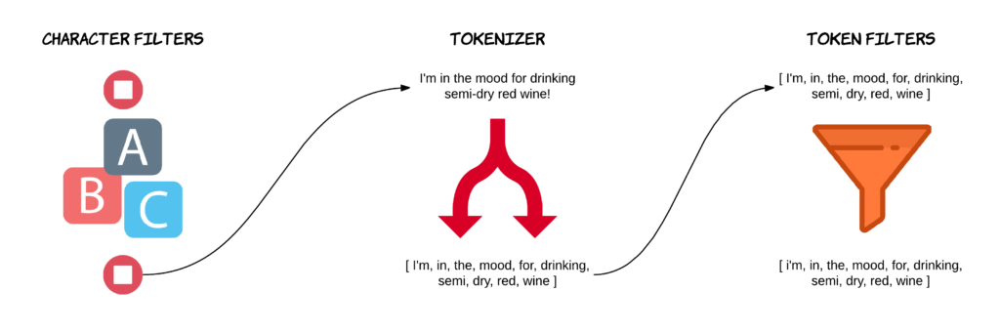
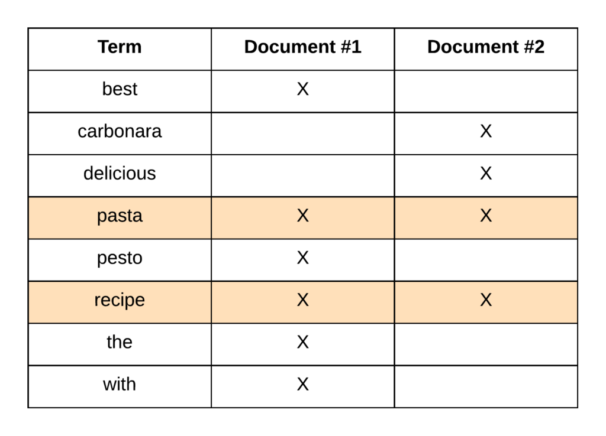
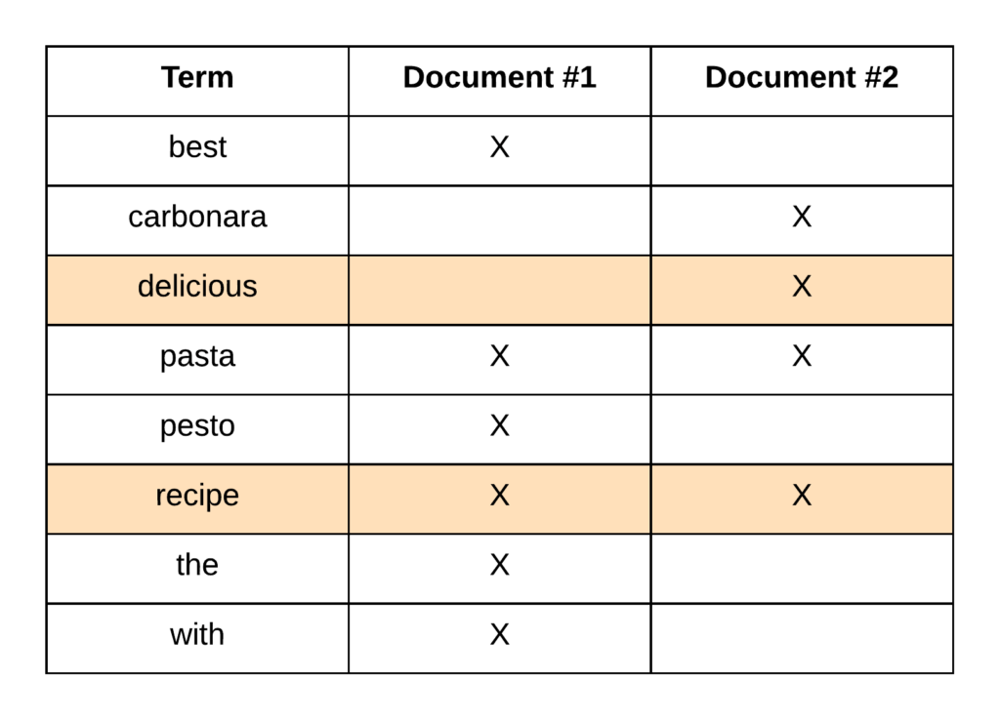

## Elasticsearch


### Architecture





### Sharding

Suppose that you have an index containing lots of documents, totalling 1 terabyte of data. You have two nodes in your cluster, each with 512 gigabytes available for storing data. Clearly the entire index will not fit on either of the nodes, so splitting the index’ data up somehow is necessary, or we would effectively be out of disk space.

Sharding solves this problem by dividing indices into smaller pieces named shards. So a shard will contain a subset of an index’ data and is in itself fully functional and independent, and you can kind of think of a shard as an “independent index.” 



So, we could divide the 1 terabyte index into four shards, each containing 256 gigabytes of data, and these shards could then be distributed across the two nodes, meaning that the index as a whole now fits with the disk capacity that we have available.



to summarize, sharding is a way of dividing an index’ data volume into smaller parts which are called shards. This enables you to distribute data across multiple nodes within a cluster, meaning that you can store a terabyte of data even if you have no single node with that disk capacity. Sharding also increases performance in cases where shards are distributed on multiple nodes, because search queries can then be parallelized, which better utilizes the hardware resources that your nodes have available to them.

But how does Elasticsearch know on which shard to store a new document, and how will it find it when retrieving it by ID? There needs to be a way of determining this, because surely it cannot be random. And also, documents should be distributed evenly between nodes by default, so that we won’t have one shard containing way more documents than another. So determining which shard a given document should be stored in or has been stored is, is called routing.



By default, the “routing” value will equal a given document’s ID. This value is then passed through a hashing function, which generates a number that can be used for the division. The remainder of dividing the generated number with the number of primary shards in the index, will give the shard number. This is how Elasticsearch determines the location of specific documents. When executing search queries (i.e. not looking a specific document up by ID), the process is different, as the query is then broadcasted to all shards.

### Replication

An index of one terabyte divided into four shards of each 256 gigabytes. The shards are now primary shards and each have a replica shard.


We have a cluster with two nodes. We only have a single index consisting of two shards, each with two replicas. We have a client on the left-hand side, which would typically be a server communicating with the cluster. In this case, we want to delete a document from the index. At this point, Elasticsearch needs to find the correct replication group, and thereby also the primary shard. This is done with so-called routing, which is not something that we will get into right now, so you can consider that a black box. Just know that something happens there that finds the appropriate replication group and its primary shard – Shard A in this example. The operation is then routed to the primary shard where it is validated and then executed. Once the operation completes on the primary shard itself, the operation is sent to the replica shards within the replication group. In this case that means that the delete operation is sent to Replica A1 and Replica A2. When the operation successfully completes on both of these replicas, the primary shard — i.e. Shard A — acknowledges that the request was successful to the client.



To sum up, a replica shard or replica is a copy of a shard. A shard with a replica is referred to as a primary shard, and a primary shard and its replicas, is referred to as a replication group. The purpose of replication is both to ensure high availability and to improve search query performance, although the main purpose is often to be more fault tolerant. This is accomplished by never storing a replica shard on the same node as its primary shard. Each shard within an index has a single replica by default, given that the cluster contains more than a single node.

### Analysis

When we index a document, Elasticsearch takes the full text fields of the document and runs them through an analysis process. The text fields are tokenized into terms, and the terms are converted to lowercase letters. At least that’s the default behavior. The results of this analysis process are added to something called the inverted index, which is what we run search queries against.


An analyzer consists of three things; character filters, token filters, and a tokenizer. 


The default behavior with the standard analyzer.



##### Example

```json
POST _analyze
{
  "tokenizer": "standard",
  "text": "I'm in the mood for drinking semi-dry red wine!"
}

POST _analyze
{
  "filter": [ "lowercase" ],
  "text": "I'm in the mood for drinking semi-dry red wine!"
}

POST _analyze
{
  "analyzer": "standard",
  "text": "I'm in the mood for drinking semi-dry red wine!"
}
```

### Inverted-index

The purpose of an inverted index, is to store text in a structure that allows for very efficient and fast full-text searches. When performing full-text searches, we are actually querying an inverted index and not the JSON documents that we defined when indexing the documents. there will be an inverted index for each full-text field per index. 

An inverted index consists of all of the unique terms that appear in any document covered by the index. For each term, the list of documents in which the term appears, is stored. So essentially an inverted index is a mapping between terms and which documents contain those terms. terms are sorted. also terms within the index are the results of the analysis process .

> The inverted index also holds information that is used internally, such as for computing relevance. </br>
> Some examples of this could be the number of documents containing each term, the number of times a term appears in a given document, the average length of a field, etc. </br>


The first step of a search query is to find the documents that match the query in the first place.if we were to search for “pasta recipe,” we would see that both documents contain both terms.



If we searched for “delicious recipe,” the results would be as follows.



An analyzer is applied to full-text fields, and the results of this analysis process are stored within an inverted index. An inverted index consists of all of the terms for a given field across all documents within an index. So when performing a search query, we are not actually searching the documents themselves, but rather an inverted index. This is important to understand because otherwise you might be left puzzled as to why some queries don’t match what you expect.

