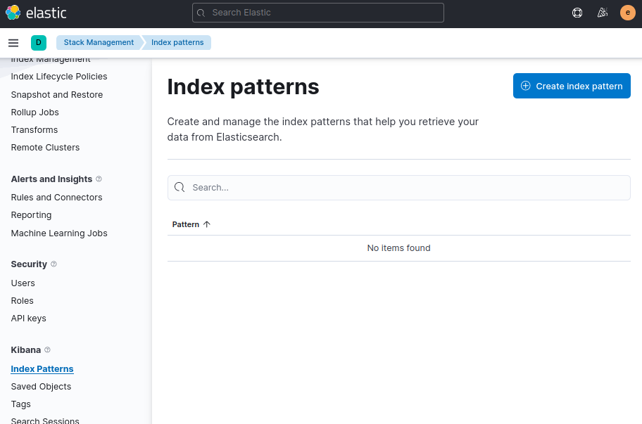
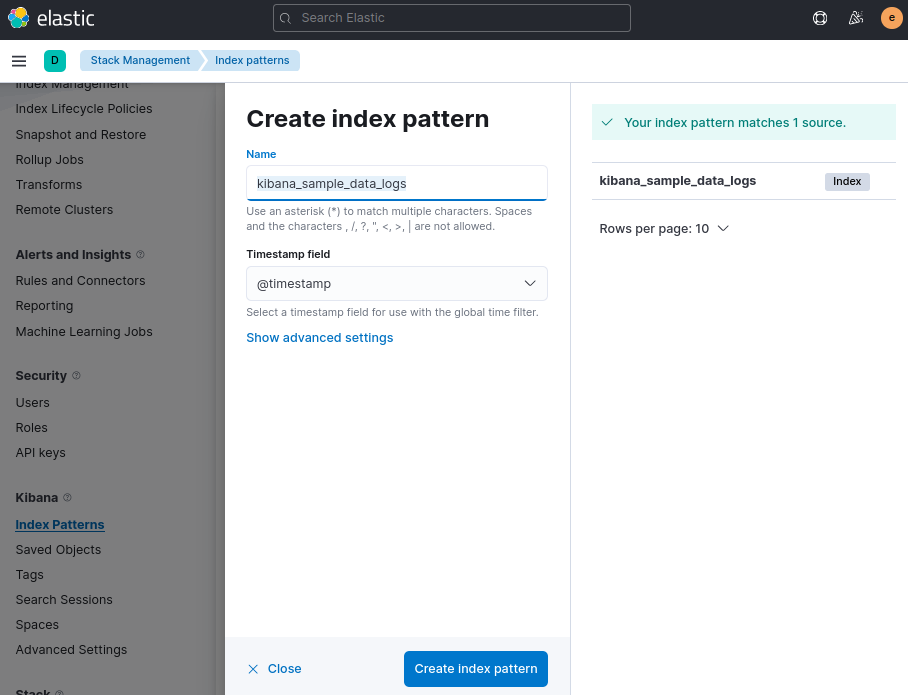
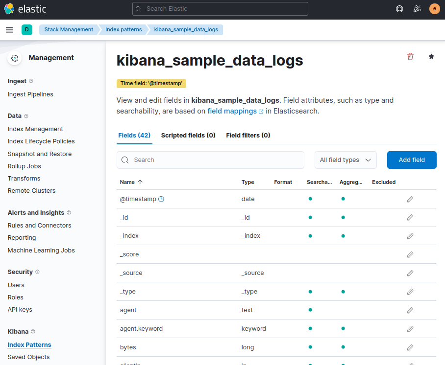

## Creating an Index pattern

> See [Kibana Doc: Create an index pattern](https://www.elastic.co/guide/en/kibana/7.17/index-patterns.html)  

> Kibana requires an index pattern to access the Elasticsearch data that you want to explore. An index pattern selects the data to use and allows you to define properties of the fields.  

1. ***Click  icon in the left menu to open the main menu, then click to `Stack Management > Index Patterns`. Then, click `Create index patterns` button to open the index pattern creation screen.***

2. ***Enter your index pattern into `Name` field.***

> e.g. kibana_sample_data_logs or kibana_sample_data_*, The last * is called a wild card to use for matching multiple indexes.
  
> If Kibana detects an index with a timestamp, expand the `Timestamp field` menu, and then select the default field for filtering your data by time.  

 

3. ***Click `Create index pattern` button to create a new index pattern.***

4. ***Select created index pattern when you search and visualize your data.***(e.g. In ***Discover***)

> ***Discover*** is a tool for viewing data in Kibana.  

